# AZ 120 Module 2: Explore the foundations of IaaS for SAP on Azure
# Lab 2a: Implement Linux clustering on Azure VMs

Estimated Time: 90 minutes

This particular lab is under the module Explore the foundations of IaaS for SAP on Azure


## Scenario
  
In preparation for deployment of SAP HANA on Azure, Adatum Corporation wants to explore the process of implementing clustering on Azure VMs running the SUSE distribution of Linux.

## Objectives
  
After completing this lab, you will be able to:

- Provision Azure compute resources necessary to support highly available SAP HANA deployments

- Configure operating system of Azure VMs running Linux to support a highly available SAP HANA installation

- Provision Azure network resources necessary to support highly available SAP HANA deployments

## Requirements

- A Microsoft Azure subscription with the sufficient number of available DSv3 vCPUs (2 x 4) and DSv2 (1 x 1) vCPUs

- A lab computer with an Azure Cloud Shell-compatible web browser and access to Azure

# Exercise 1: Provision Azure compute resources necessary to support highly available SAP HANA deployments

Duration: 30 minutes

In this exercise, you will deploy Azure infrastructure compute components necessary to configure Linux clustering. This will involve creating a pair of Azure VMs running Linux SUSE in the same availability set.

## Task 1: Deploy Azure VMs running Linux SUSE

1. Type **Proximity placement (1)** groups in the search box of the Azure portal menu, and select it **(2)**.

    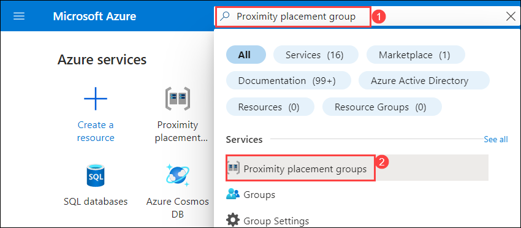

1. Click on **Create Proximity placement group**.

    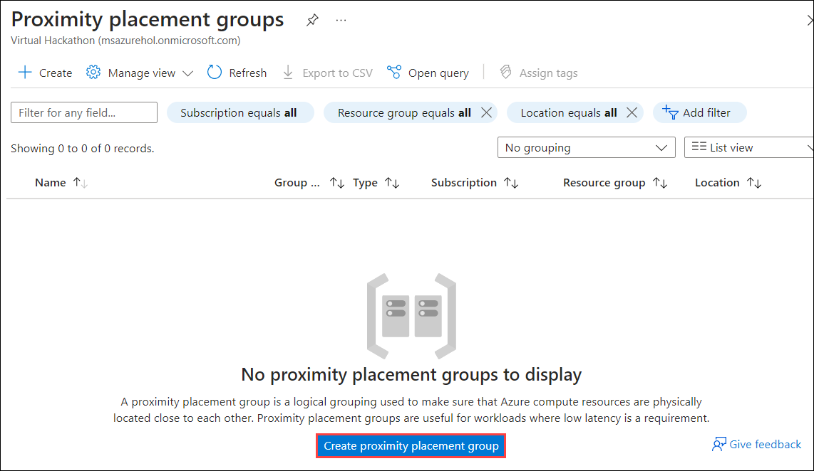
    
3. On the **Basics** tab of the **Create Proximity Placement Groups** blade, specify the following settings:

   - Subscription: Select your **Azure subscription (1)**

   - Resource group: Select **az12001a-RG(2)** ftom the drop-down list.

   - Region: Choose **<inject key="Region" enableCopy="false"/> (3)**

   - Proximity placement group name: Enter **az12001a-ppg (4)**
   
   - VM Sizes : Leave it as **Default (5)**

   - Click on **Review + Create (6)**

      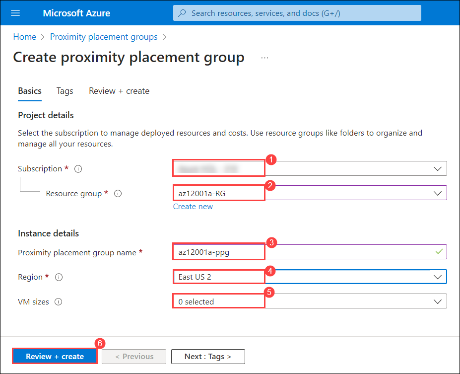
      
1. Review the configuation and click on **Create**.

   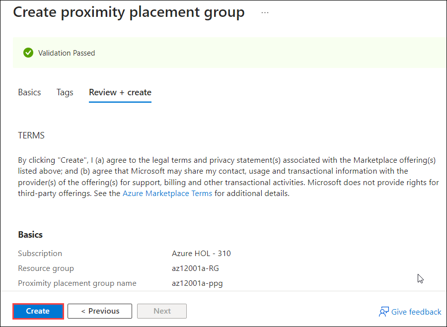

   > **Note**: Wait for the provisioning to complete. This should take less than a minute.
  
1. On Azure portal **Home** page, search for **Virtual machines (1)** and select it **(2)**.

    
    
1. On the **Virtual machines** blade, select **+ Create (1)** and, in the drop-down menu, select **Azure virtual machine (2)**.

    
  
1. On the **Basics** tab of the **Create a virtual machine** blade, specify the following settings :

   - Subscription: Select your **Azure subscription (1)**

   - Resource group: Select **az12001a-RG (2)** ftom the drop-down list.
   
   - Virtual machine name: Enter **az12001a-vm0 (3)** 

   - Region: Choose **<inject key="Region" enableCopy="false"/> (4)**

   - Availability options: Select **Availability set (5)**
   
       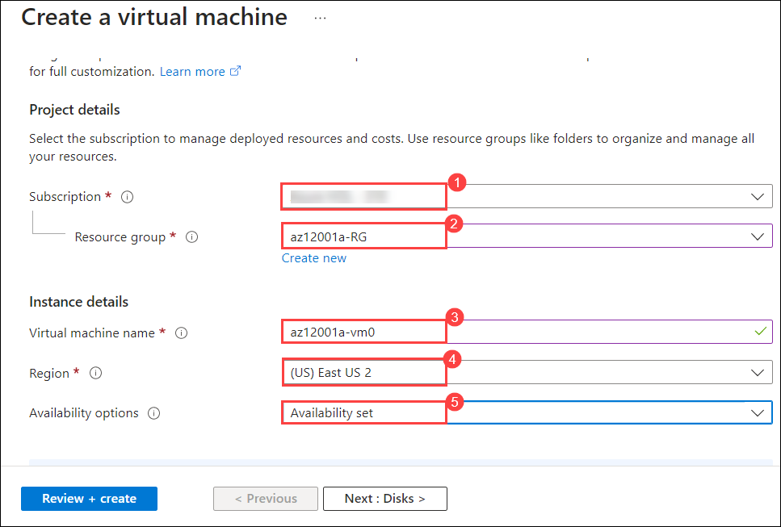

   - Availability set: To create a new availability set follow the below instructions: 
   
        - Click on **Create new (7)**
        
        - Name : Enter **az12001a-avset (8)** 
        
        - Fault domain : Choose **2 (9)** 
        
        - Update domains : Choose **5 (10)**
        
        - Click on **Ok (11)**
     
        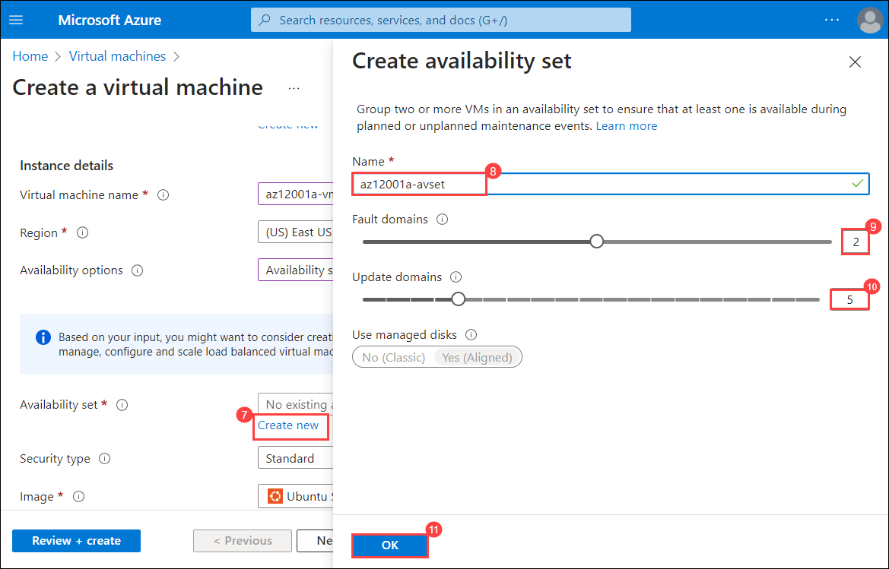
     
   -  Securuty type: Leave it as **Default (12)**
   
   - Image: **SUSE Enterprise Linux for SAP 12 SP5 - BYOS - Gen 1 (13)**
   
     > **Note**: To locate the image, click the **See all images** link, on the **Select an image** blade, in the search text box, type **SUSE Enterprise Linux for SAP 12 BYOS** and, in the list of results, click **SUSE Enterprise Linux for SAP 12 SP5 - BYOS**.

  
   - Run with Azure Spot discount: Uncheck the box **(14)**

   - Size: Select **Standard D4s v3 (15)**

   - Authentication type: Choose **Password (16)**

   - Username: Enter **student (17)**

   - Password: Enter **Pa55w.rd1234 (18)**

   - Confirm Password : Enter **Pa55w.rd1234 (19)**

   -  Click on **Next : Disks > (20)**

   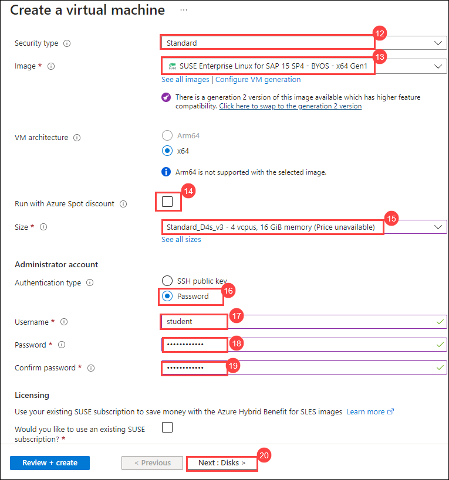
   
1. On the **Disks** tab of the **Create a virtual machine** blade, specify the following settings: 

   - OS disk type: **Premium SSD (1)**

   - Key management: **Platform-managed key (2)**

    - Click on **Next: Networking > (3)**
   
      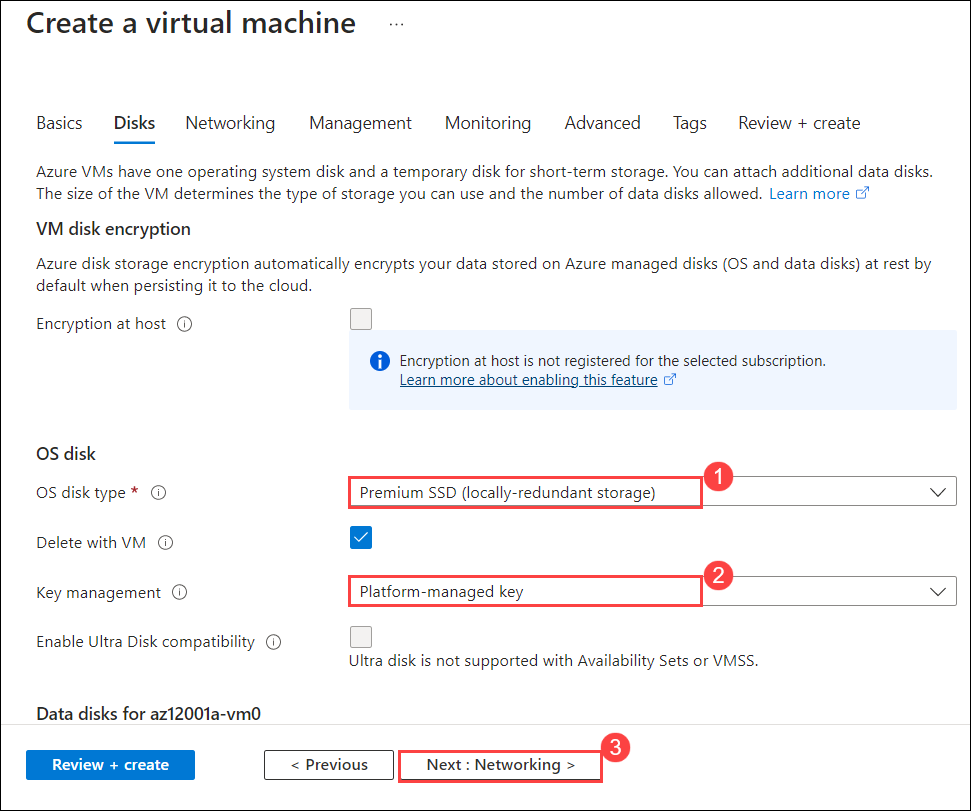

1. On the **Networking** tab of the **Create a virtual machine** blade, specify the following settings: 

   - Virtual network: Select **Create new (1)** and follow the below instructons:
   
        - Name: Enter **az12001a-RG-vnet (2)**
        - Address space: Set the address space of the new virtual network to **192.168.0.0/20 (3)**
        - Subnet name: Enter **subnet-0 (4)**
        - Subnet address range: **192.168.0.0/24 (5)**
        - Click on **Ok (6)**
    
        

1. Leave all the coloumns as default and select **Next: Management >**
   
     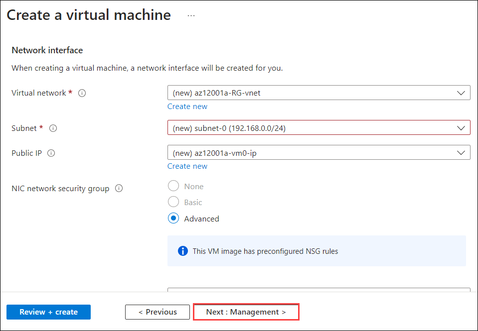
     
1. On the **Management** tab of the **Create a virtual machine** blade, leave everything as default and **Next: Monitoring >**.

    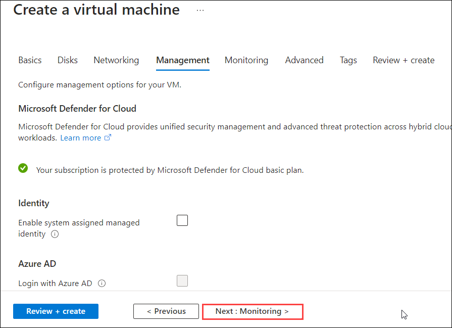
    
1. On the **Monitoringt** tab of the **Create a virtual machine** blade, leave everything as default and **Next: Advanced >**.

    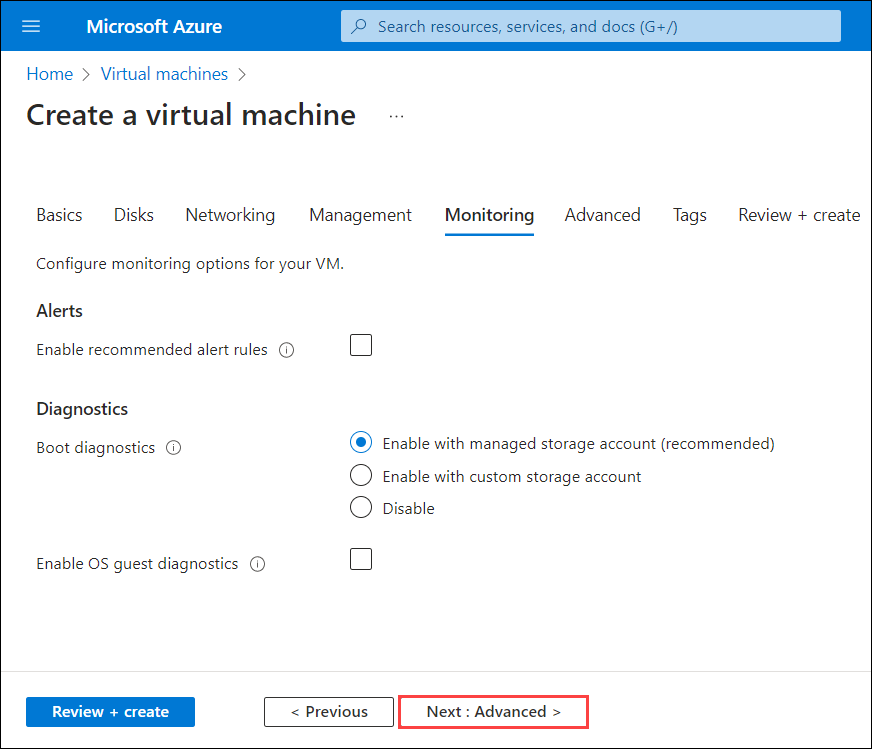

1. On the **Advanced** tab of the **Create a virtual machine** blade, specify the following settings and select **Review + create (2)** (leave all other settings with their default value):

   - Proximity placement group: From the drop-down select **az12001a-ppg (1)**

   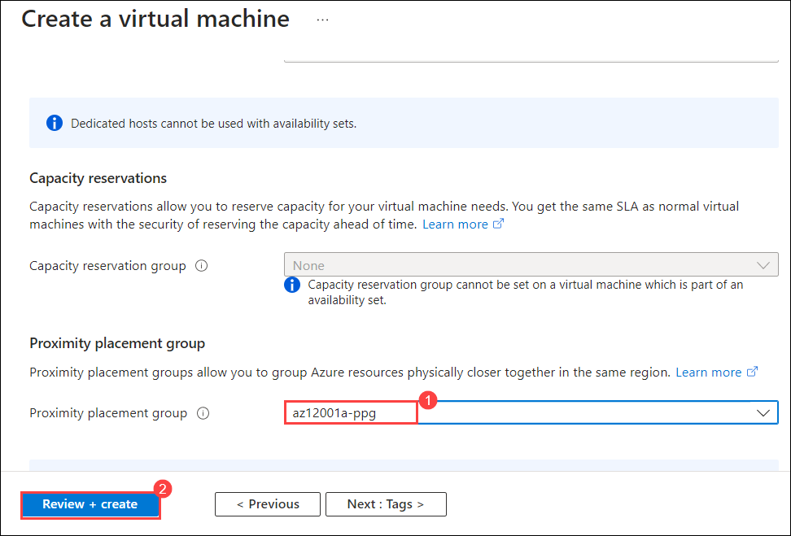

1. On the **Review + create** tab of the **Create a virtual machine** blade, select **Create**.

    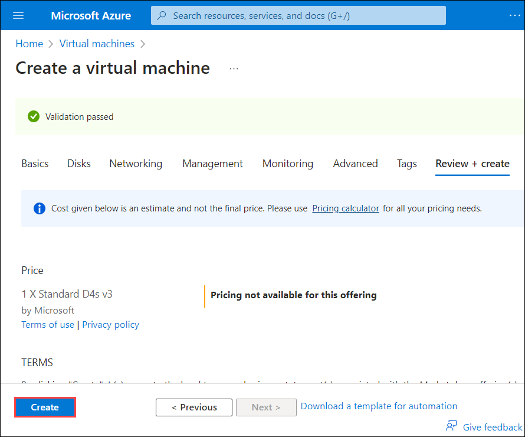

    > **Note**: Wait for the provisioning to complete. This should take less about 3 minutes.
    
1. Navigate back to the Azure portal **Home** page, search for **Virtual machines (1)** and select it **(2)**.

    
    
1. On the **Virtual machines** blade, select **+ Create (1)** and, in the drop-down menu, select **Azure virtual machine (2)**.

    
  
1. On the **Basics** tab of the **Create a virtual machine** blade, specify the following settings :

   - Subscription: Select your **Azure subscription (1)**

   - Resource group: Select **az12001a-RG (2)** ftom the drop-down list.
   
   - Virtual machine name: Enter **az12001a-vm1 (3)** 

   - Region: Choose **<inject key="Region" enableCopy="false"/> (4)**

   - Availability options: Select **Availability set (5)**
   
   - Availability set: Choose **az12001a-avset (6)** from drop-down
   
   -  Securuty type: Leave it as **Default (7)**
   
   - Image: **SUSE Enterprise Linux for SAP 12 SP5 - BYOS - Gen 1 (8)**
   
     > **Note**: To locate the image, click the **See all images** link, on the **Select an image** blade, in the search text box, type **SUSE Enterprise Linux for SAP 12 BYOS** and, in the list of results, click **SUSE Enterprise Linux for SAP 12 SP5 - BYOS**.

     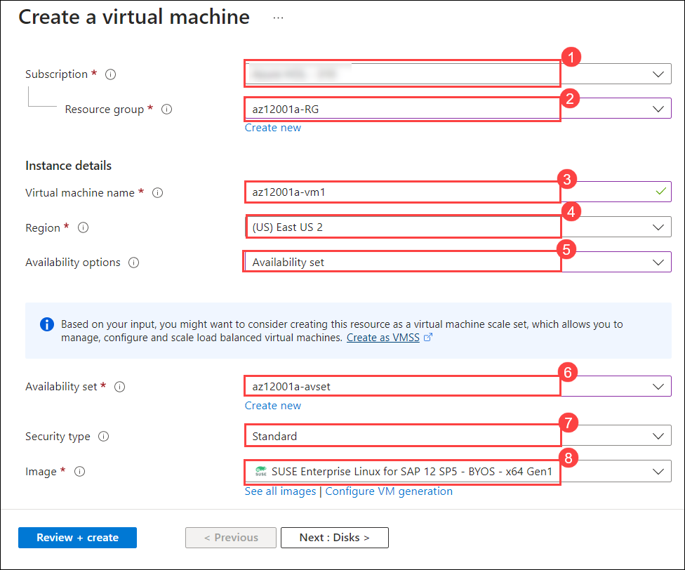
     
   - Run with Azure Spot discount: Uncheck the box **(9)**

   - Size: Select **Standard D4s v3 (10)**

   - Authentication type: Choose **Password (11)**

   - Username: Enter **student (12)**

   - Password: Enter **Pa55w.rd1234 (13)**

   - Confirm Password : Enter **Pa55w.rd1234 (14)**

   -  Click on **Next : Disks > (15)**

   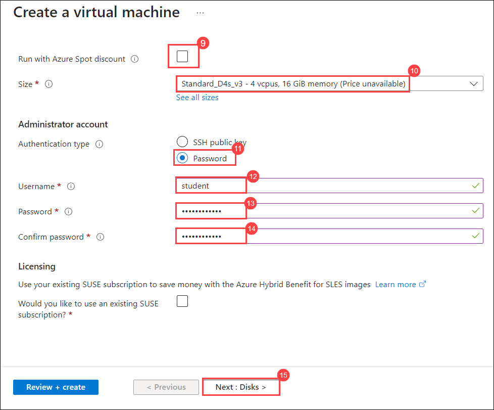
   
1. On the **Disks** tab of the **Create a virtual machine** blade, specify the following settings: 

   - OS disk type: **Premium SSD (1)**

   - Key management: **Platform-managed key (2)**

    - Click on **Next: Networking > (3)**
   
      

1. On the **Networking** tab of the **Create a virtual machine** blade, specify the following settings: 

   - Virtual network: Select **az12001a-RG-vnet (1)** 
   - Subnet : Select **Subnet-0 (2)**
   - Click on **Next: Management > (3)**

   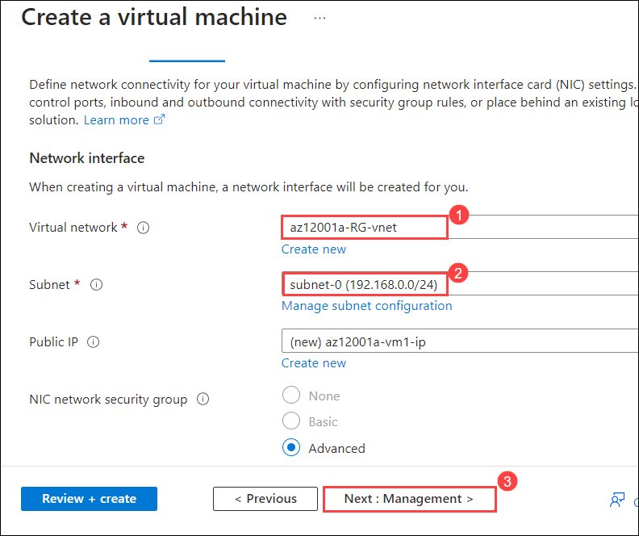
     
1. On the **Management** tab of the **Create a virtual machine** blade, leave everything as default and **Next: Monitoring >**.

    
    
1. On the **Monitoringt** tab of the **Create a virtual machine** blade, leave everything as default and **Next: Advanced >**.

    

1. On the **Advanced** tab of the **Create a virtual machine** blade, specify the following settings and select **Review + create (2)** (leave all other settings with their default value):

   - Proximity placement group: From the drop-down select **az12001a-ppg (1)**

   

1. On the **Review + create** tab of the **Create a virtual machine** blade, select **Create**.

    

    > **Note**: Wait for the provisioning to complete. This should take less about 3 minutes.


## Task 2: Create and configure Azure VMs disks

1. Open a Cloud Shell prompt by selecting the icon shown below. 

     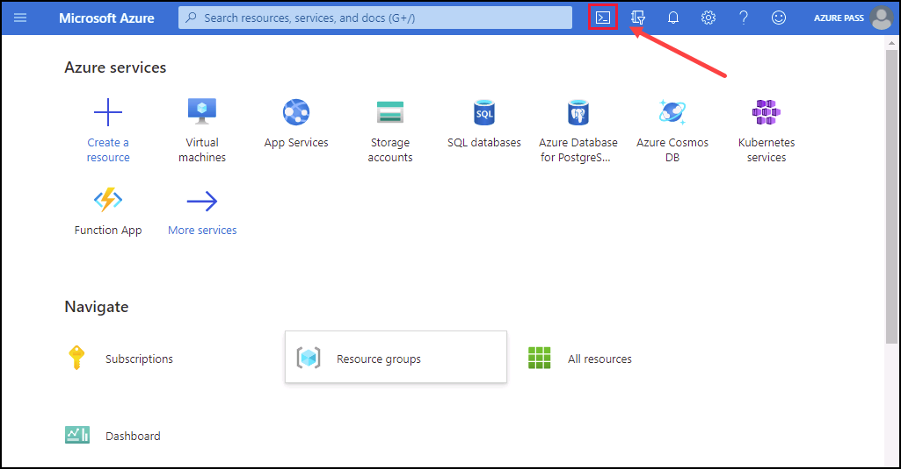

1. At the bottom half of the portal, you may see a message welcoming you to the Azure Cloud Shell, if you have not yet used a Cloud Shell. Select Bash.

     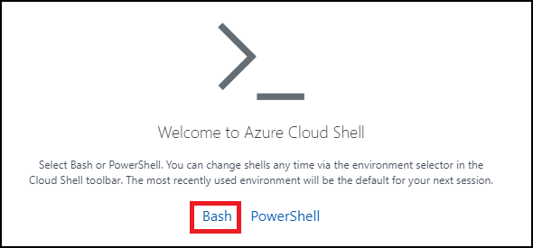

1. If you have not previously used a Cloud Shell, you must configure a storage. Select **Subscription (1)** and Click on **Show advanced settings (2)**.

    
    
1. Follow the below instructions to create storage account: 

    - Resource group : Choose **labvm-rg (1)** from the drop down
    - Storage account : Enter **stacc<inject key="Deployment ID" enableCopy="false"/> (2)**
    - File share : Enter **blob (3)**
    - Click on **Create storage (4)**

    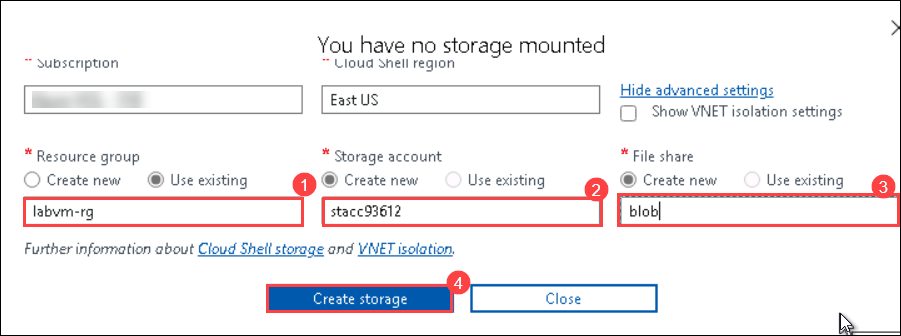
    
1. Once complete, you will see a prompt similar to the one below. Verify that the upper left corner of the Cloud Shell screen shows Bash.

     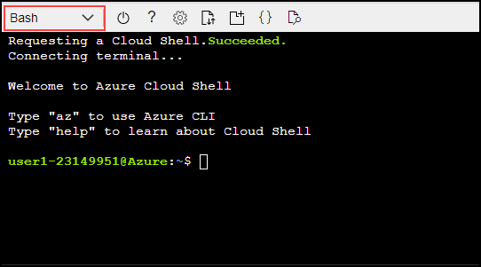
   
1. In the Cloud Shell pane, run the following command to set the value of the variable `RESOURCE_GROUP_NAME` to the name of the resource group containing the resources you provisioned in the previous task:

   ```cli
   RESOURCE_GROUP_NAME='az12001a-RG'
   ```

1. In the Cloud Shell pane, run the following command to create the first set of 8 managed disks that you will attach to the first Azure VM you deployed in the previous task:

   ```cli
   LOCATION=$(az group list --query "[?name == '$RESOURCE_GROUP_NAME'].location" --output tsv)

   for I in {0..7}; do az disk create --resource-group $RESOURCE_GROUP_NAME --name az12001a-vm0-DataDisk$I --size-gb 128 --location $LOCATION --sku Premium_LRS; done
   ```

1. In the Cloud Shell pane, run the following command to create the second set of 8 managed disks that you will attach to the second Azure VM you deployed in the previous task:

   ```cli
   for I in {0..7}; do az disk create --resource-group $RESOURCE_GROUP_NAME --name az12001a-vm1-DataDisk$I --size-gb 128 --location $LOCATION --sku Premium_LRS; done
   ```

1. From Azure portal, navigate to the blade of the first Azure VM **az12001a-vm0** you provisioned in the previous task.

1. From the **az12001a-vm0** blade, navigate to the **az12001a-vm0 | Disks** blade.

    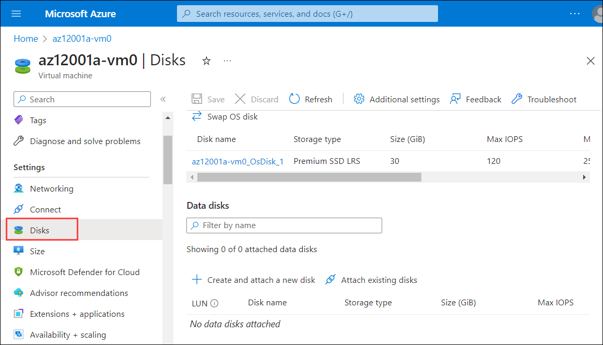

1. On the **az12001a-vm0 \| Disks** blade, select **Attach existing disks** and attach data disk with the following settings to az12001a-vm0:

   - LUN: **0**

   - Disk name: **az12001a-vm0-DataDisk0**

   - HOST CACHING: **Read-only**

       
1. Repeat the previous step to attach the remaining 7 disks with the prefix **az12001a-vm0-DataDisk** (for the total of 8). Assign the LUN number matching the last character of the disk name. Set HOST CACHING of the disk with LUN **1** to **Read-only** and, for all the remaining ones, set HOST CACHING to **None**.

1. Save your changes. 
    
     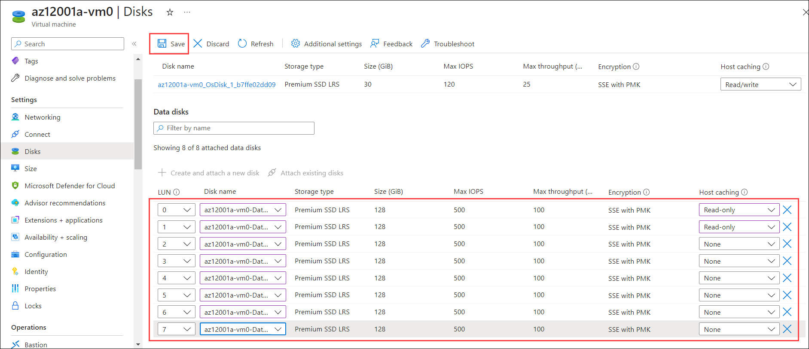

1. In the Azure portal, navigate to the blade of the second Azure VM **az12001a-vm1** you provisioned in the previous task.

1. From the **az12001a-vm1** blade, navigate to the **az12001a-vm1 | Disks** blade.

    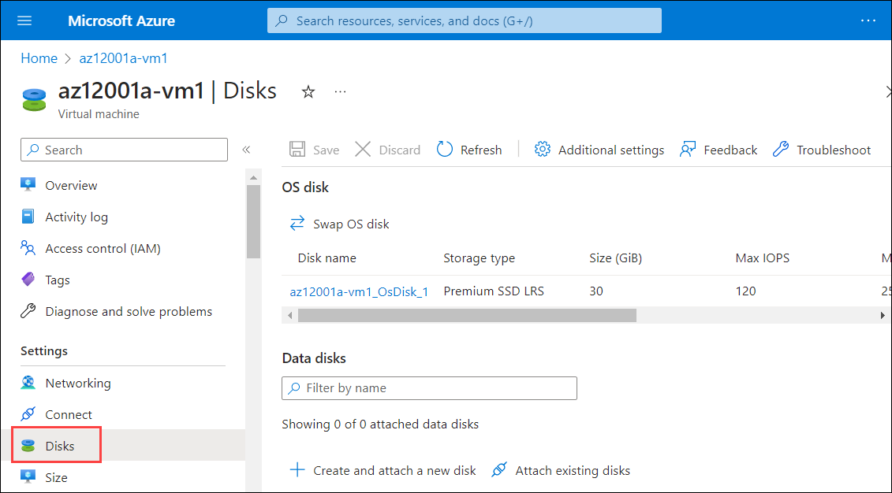

1. From the **az12001a-vm1 \| Disks** blade, attach data disks with the following settings to az12001a-vm1:

   - LUN: **0**

   - Disk name: **az12001a-vm1-DataDisk0**

   - HOST CACHING: **Read-only**

1. Repeat the previous step to attach the remaining 7 disks with the prefix **az12001a-vm1-DataDisk** (for the total of 8). Assign the LUN number matching the last character of the disk name. Set HOST CACHING of the disk with LUN **1** to **Read-only** and, for all the remaining ones, set HOST CACHING to **None**.

1. Save your changes. 

    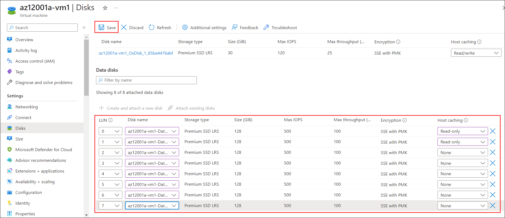

  > **Result**: After you completed this exercise, you have provisioned Azure compute resources necessary to support highly available SAP HANA deployments.


# Exercise 2: Configure operating system of Azure VMs running Linux to support a highly available SAP HANA installation

Duration: 30 minutes

In this exercise, you will configure operating system and storage on Azure VMs running SUSE Linux Enterprise Server to accommodate clustered installations of SAP HANA.

## Task 1: Connect to Azure Linux VMs

1. In the Cloud Shell pane, run the following command to set the value of the variable `RESOURCE_GROUP_NAME` to the name of the resource group containing the resources you provisioned in the previous exercise:

   ```cli
   RESOURCE_GROUP_NAME='az12001a-RG'
   ```

1. In the Cloud Shell pane, run the following command to identify the public IP address of the first Azure VM you deployed in the previous exercise:

   ```cli
   PIP=$(az network public-ip show --resource-group $RESOURCE_GROUP_NAME --name az12001a-vm0-ip --query ipAddress --output tsv)
   ```

1. In the Cloud Shell pane, run the following command to establish an SSH session to the IP address you identified in the previou step:

   ```cli
   ssh student@$PIP
   ```

1. When prompted whether you are sure to continue connecting, type `yes` and press the **Enter** key. 

1. When prompted for the password, type `Pa55w.rd1234` and press the **Enter** key. 

1. Open another Cloud Shell Bash session by clicking the **Open new session** icon in the Cloud Shell toolbar.

1. In the newly opened Cloud Shell Bash session, repeat all of the steps in this tasks to connect to the **az12001a-vm1** Azure VM via its IP address **az12001a-vm1-ip**.

   ```cli
   RESOURCE_GROUP_NAME='az12001a-RG'
   ```
   
   ```cli
   PIP=$(az network public-ip show --resource-group $RESOURCE_GROUP_NAME --name az12001a-vm1-ip --query ipAddress --output tsv)
   ```
   
   ```cli
   ssh student@$PIP
   ```
   

## Task 2: Configure storage of Azure VMs running Linux

1. In the Cloud Shell pane, in the SSH session to az12001a-vm0, run the following command to elevate privileges: 

   ```cli
   sudo su -
   ```

1. In the Cloud Shell pane, in the SSH session to az12001a-vm0, run the following command to identify the mapping between the newly attached devices and their LUN numbers:
   
   ```cli
   lsscsi
   ```

1. In the Cloud Shell pane, in the SSH session to az12001a-vm0, create physical volumes for 6 (out of 8) data disks by running:
   
   ```cli
   pvcreate /dev/sdc
   pvcreate /dev/sdd
   pvcreate /dev/sde
   pvcreate /dev/sdf
   pvcreate /dev/sdg
   pvcreate /dev/sdh
   ```

1. In the Cloud Shell pane, in the SSH session to az12001a-vm0, create volume groups by running:
   
   ```cli
   vgcreate vg_hana_data /dev/sdc /dev/sdd
   vgcreate vg_hana_log /dev/sde /dev/sdf
   vgcreate vg_hana_backup /dev/sdg /dev/sdh
   ```

1. In the Cloud Shell pane, in the SSH session to az12001a-vm0, create logical volumes by running:

   ```cli
   lvcreate -l 100%FREE -n hana_data vg_hana_data
   lvcreate -l 100%FREE -n hana_log vg_hana_log
   lvcreate -l 100%FREE -n hana_backup vg_hana_backup
   ```

   > **Note**: We are creating a single logical volume per each volume group

1. In the Cloud Shell pane, in the SSH session to az12001a-vm0, format the logical volumes by running:

   ```cli
   mkfs.xfs /dev/vg_hana_data/hana_data -m crc=1
   mkfs.xfs /dev/vg_hana_log/hana_log -m crc=1
   mkfs.xfs /dev/vg_hana_backup/hana_backup -m crc=1
   ```

   > **Note**: Starting with SUSE Linux Enterprise Server 12, you have the option to use the new on-disk format (v5) of the XFS file system, which offers automatic checksums of XFS metadata, file type support, and an increased limit on the number of access control lists per file. The new format applies automatically when using YaST to create the XFS file systems. To create an XFS file system in the older format for compatibility reasons, use the mkfs.xfs command without the `-m crc=1` option. 

1. In the Cloud Shell pane, in the SSH session to az12001a-vm0, partition the **/dev/sdi** disk by running:

   ```cli
   fdisk /dev/sdi
   ```

1. When prompted, type, in sequence, `n`, `p`, `1` (followed by the **Enter** key each time) press the **Enter** key twice, and then type `w` to complete the write.

1. In the Cloud Shell pane, in the SSH session to az12001a-vm0, partition the **/dev/sdj** disk by running:

   ```cli
   fdisk /dev/sdj
   ```

1. When prompted, type, in sequence, `n`, `p`, `1` (followed by the **Enter** key each time) press the **Enter** key twice, and then type `w` to complete the write.

1. In the Cloud Shell pane, in the SSH session to az12001a-vm0, format the newly created partition by running (type `y` and press the **Enter** key when prompted for confirmation)	:

   ```cli
   mkfs.xfs /dev/sdi -m crc=1 -f
   mkfs.xfs /dev/sdj -m crc=1 -f
   ```

1. In the Cloud Shell pane, in the SSH session to az12001a-vm0, create the directories that will serve as mount points by running:

   ```cli
   mkdir -p /hana/data
   mkdir -p /hana/log
   mkdir -p /hana/backup
   mkdir -p /hana/shared
   mkdir -p /usr/sap
   ```

1. In the Cloud Shell pane, in the SSH session to az12001a-vm0, display the ids of logical volumes by running:

   ```cli
   blkid
   ```

   > **Note**: Identify the **UUID** values associated with the newly created volume groups and partitions, including **/dev/sdi** (to be used for **/hana/shared**) and **dev/sdj** (to be used for **/usr/sap**) Copy the value of the key into Clipboard you will need the UUID values in the next task.


1. In the Cloud Shell pane, in the SSH session to az12001a-vm0, open **/etc/fstab** in the vi editor (you are free to use any other editor) by running:

   ```cli
   vi /etc/fstab
   ```

1. In the editor, add the following entries to **/etc/fstab** (where `\<UUID of /dev/vg\_hana\_data-hana\_data\>`, `\<UUID of /dev/vg\_hana\_log-hana\_log\>`, `\<UUID of /dev/vg\_hana\_backup-hana\_backup\>`, `\<UUID of /dev/vg_hana_shared-hana_shared (/dev/sdi)\>`, and `\<UUID of /dev/vg_usr_sap-usr_sap (/dev/sdj)\>`, represent the ids you identified in the previous step):

   ```cli
   /dev/disk/by-uuid/<UUID of /dev/vg_hana_data-hana_data> /hana/data xfs  defaults,nofail  0  2
   /dev/disk/by-uuid/<UUID of /dev/vg_hana_log-hana_log> /hana/log xfs  defaults,nofail  0  2
   /dev/disk/by-uuid/<UUID of /dev/vg_hana_backup-hana_backup> /hana/backup xfs  defaults,nofail  0  2
   /dev/disk/by-uuid/<UUID of /dev/vg_hana_shared-hana_shared (/dev/sdi)> /hana/shared xfs  defaults,nofail  0  2
   /dev/disk/by-uuid/<UUID of /dev/vg_usr_sap-usr_sap (/dev/sdj)> /usr/sap xfs  defaults,nofail  0  2
   ```

1. Save the changes and close the editor using **:wq!**.

1. In the Cloud Shell pane, in the SSH session to az12001a-vm0, mount the new volumes by running:

   ```cli
   mount -a
   ```

1. In the Cloud Shell pane, in the SSH session to az12001a-vm0, verify that the mount was successful by running:

   ```cli
   df -h
   ```

1. Switch to the Cloud Shell Bash session to az12001a-vm1 and repeat all of the steps in this tasks to configure storage on **az12001a-vm1**.


## Task 3: Enable cross-node password-less SSH access

1. In the Cloud Shell pane, in the SSH session to az12001a-vm0, generate passphrase-less SSH key by running:

   ```cli
   ssh-keygen -tdsa
   ```

1. When prompted, press **Enter** three times and then display the public key by running: 

   ```cli
   cat /root/.ssh/id_dsa.pub
   ```

1. You will find the ssh key  which is saved in "/ root/.ssh/" path. run the following commands to get the key and copy the key value into Clipboard.
    
    ```cli
    cd /root/.ssh/

    cat id_rsa.pub
    ```
   
    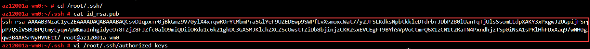


1. In the Cloud Shell pane, in the SSH session to az12001a-vm1, create a file **/root/.ssh/authorized\_keys** in the vi editor (you are free to use any other editor) by running:

   ```cli
   vi /root/.ssh/authorized_keys
   ```

1. In the editor window, paste the key you generated on az12001a-vm0.

1. Save the changes and close the editor using **:wq!**.

1. In the Cloud Shell pane, in the SSH session to az12001a-vm1, generate passphrase-less SSH key by running:

   ```cli
   ssh-keygen -tdsa
   ```

1. When prompted, press **Enter** three times and then display the public key by running: 

   ```cli
   cat /root/.ssh/id_dsa.pub
   ```

1.  You will find the ssh key  which is saved in "/ root/.ssh/" path. run the following commands to get the key and copy the key value into Clipboard.
    
      ```cli
      cd /root/.ssh/

      cat id_dsa.pub
      ```
      
      
      
1. Switch to the Cloud Shell pane containing the SSH session to az12001a-vm0 and create a file **/root/.ssh/authorized\_keys** in the vi editor (you are free to use any other editor) by running:

   ```cli
   vi /root/.ssh/authorized_keys
   ```

1. In the editor window, paste the key you generated on az12001a-vm1.

1. Save the changes and close the editor using **:wq!**.

1. In the Cloud Shell pane, in the SSH session to az12001a-vm1, generate passphrase-less SSH key by running:

   ```cli
   ssh-keygen -t rsa
   ```
1. In the Cloud Shell pane, in the SSH session to az12001a-vm0, open the file **/etc/ssh/sshd\_config** in the vi editor (you are free to use any other editor) by running:

   ```cli
   vi /etc/ssh/sshd_config
   ```

1. In the **/etc/ssh/sshd\_config** file, locate the **PermitRootLogin** and **AuthorizedKeysFile** on the first line, and configure them as follows (remove the leading **#** character if needed:

   ```cli
   PermitRootLogin yes
   AuthorizedKeysFile  /root/.ssh/authorized_keys
   ```

1. Save the changes and close the editor using **:wq!**.

1. In the Cloud Shell pane, in the SSH session to az12001a-vm0, restart sshd daemon by running:

   ```cli
   systemctl restart sshd
   ```

1. Repeat the previous four steps on **az12001a-vm1**.

1. To verify that the configuration was successful, in the Cloud Shell pane, in the SSH session to az12001a-vm0, establish an SSH session as **root** from az12001a-vm0 to az12001a-vm1 by running: 

   ```cli
   ssh root@az12001a-vm1
   ```

1. When prompted whether you are sure to continue connecting, type `yes` and press the **Enter** key. 

1. Ensure that you are not prompted for the **password**.

1. Close the SSH session from az12001a-vm0 to az12001a-vm1 by running: 

   ```cli
   exit
   ```

1. Sign out from az12001a-vm0 by running the following twice:

   ```cli
   exit
   ```

1. To verify that the configuration was successful, in the Cloud Shell pane, in the SSH session to az12001a-vm1, establish an SSH session as **root** from az12001a-vm1 to az12001a-vm0 by running: 

   ```cli
   ssh root@az12001a-vm0
   ```

1. When prompted whether you are sure to continue connecting, type `yes` and press the **Enter** key. 

1. Ensure that you are not prompted for the **password**.

1. Close the SSH session from az12001a-vm1 to az12001a-vm0 by running: 

   ```cli
   exit
   ```

1. Sign out from az12001a-vm1 by running the following twice:

   ```cli
   exit
   ```

> **Result**: After you completed this exercise, you have configured operating system of Azure VMs running Linux to support a highly available SAP HANA installation


# Exercise 3: Provision Azure network resources necessary to support highly available SAP HANA deployments

Duration: 30 minutes

In this exercise, you will implement Azure Load Balancers to accommodate clustered installations of SAP HANA.


## Task 1: Configure Azure VMs to facilitate load balancing setup.

   > **Note**: Since you will be setting up a pair of Azure Load Balancer of the Stardard SKU, you need to first remove the public IP addresses associated with network adapters of two Azure VMs that will be serving as the load-balanced backend pool.

1. In the Azure portal, navigate to the blade of the **az12001a-vm0** Azure VM.

1. From the **az12001a-vm0** blade, navigate to the **az12001a-vm0 \| Networking** blade and, on the **az12001a-vm0 \| Networking** blade, select the entry representing the public IP address **az12001a-vm0-ip** associated with its network adapter.

     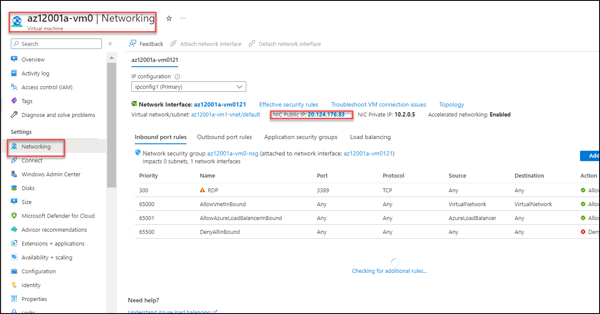

1. On the **az12001a-vm0-ip** blade, select **Dissociate**, and then select **Yes** to disconnect the public IP address from the network interface and then select **Delete** and then **Yes** to delete it.

     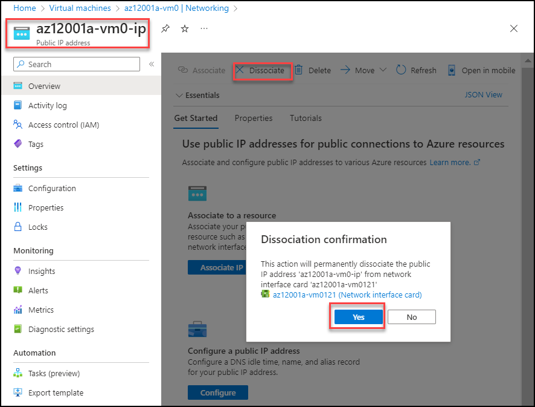    

1. In the Azure portal, navigate to the blade of the **az12001a-vm1** Azure VM.

1. From the **az12001a-vm1** blade, navigate to the **az12001a-vm1 \| Networking** blade and, on the **az12001a-vm1 \| Networking** blade, select the entry representing the public IP address **az12001a-vm1-ip** associated with its network adapter.

     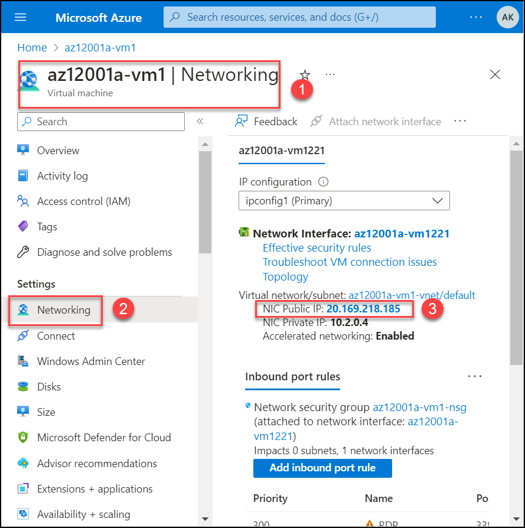    

1. On the **az12001a-vm1-ip** blade, select **Dissociate**, and then select **Yes** to disconnect the public IP address from the network interface and then select **Delete** and then **Yes** to delete it.

     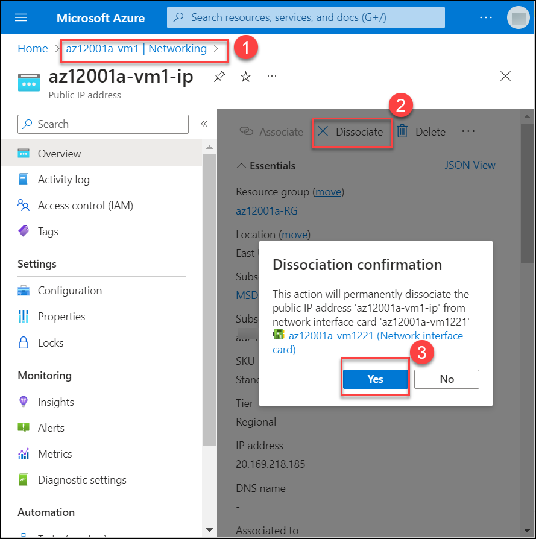  

1. In the Azure portal, navigate to the blade of the **az12001a-vm0** Azure VM.

1. From the **az12001a-vm0** blade, navigate to the **az12001a-vm0 \| Networking** blade. 

1. From the **az12001a-vm0 \| Networking** blade, select the entry representing the network interface of the az12001a-vm0. 

     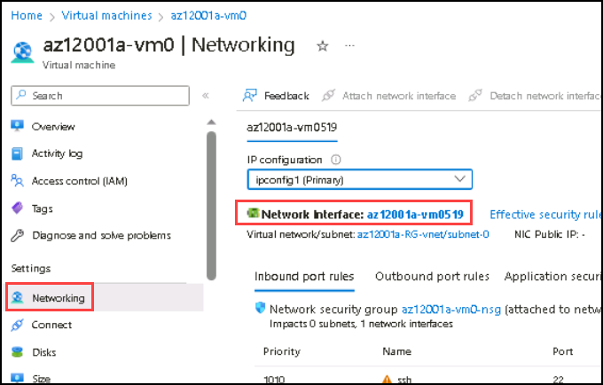  

1. From the blade of the network interface of the az12001a-vm0, navigate to its **IP configurations (1)** blade and click on **ipconfig1 (2)**.

   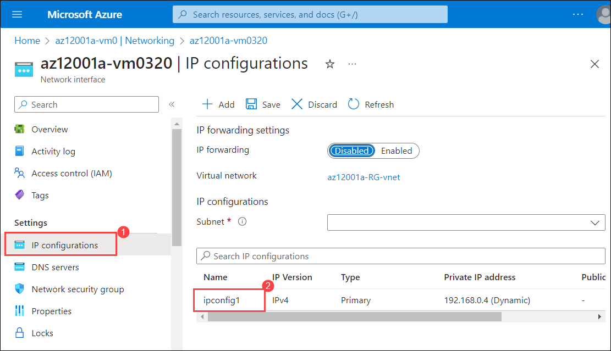

1. On the **ipconfig1** blade, set the private IP address assignment to **Static (1)** and clck on **Save (2)**.

    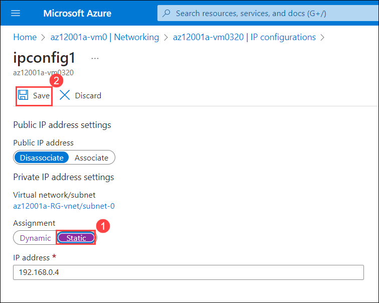  

1. In the Azure portal, navigate to the blade of the **az12001a-vm1** Azure VM.

1. From the **az12001a-vm1** blade, navigate to the **az12001a-vm1 \| Networking** blade and click on **network interface of the az12001a-vm1**.

    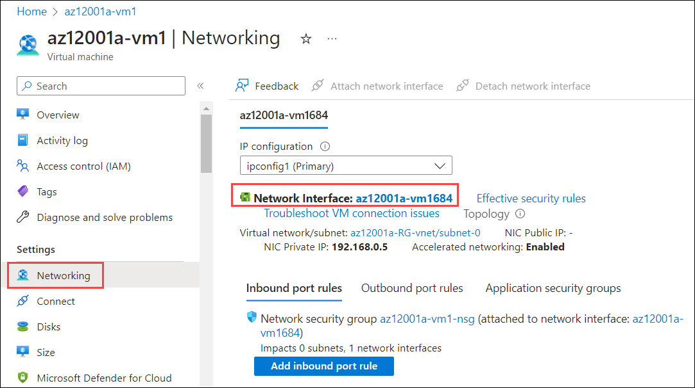

1. From the blade of the network interface of the az12001a-vm1, navigate to its **IP configurations (1)** blade and, from there, display its **ipconfig1 (2)** blade.

    
    
1. On the **ipconfig1** blade, set the private IP address assignment to **Static (1)** and click on **Save (2)** the change.

    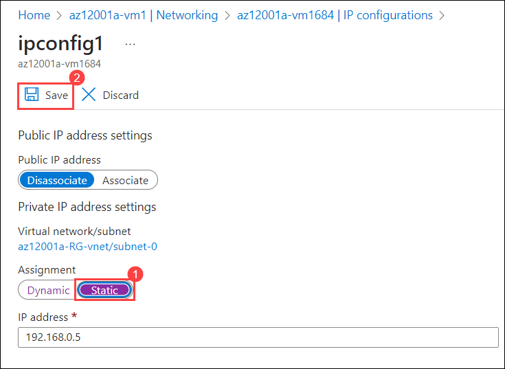
    
### Task 2: Create and configure Azure Load Balancers handling inbound traffic

1. From Azure Portal **Home** page, search for **Load balancer** and select it from the list **(2)**.

    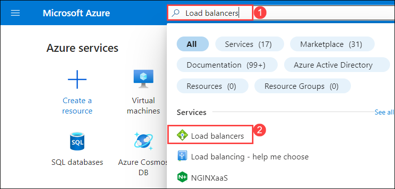
    
1. On the **Load balancers** blade, click on **Create load balancer**.

     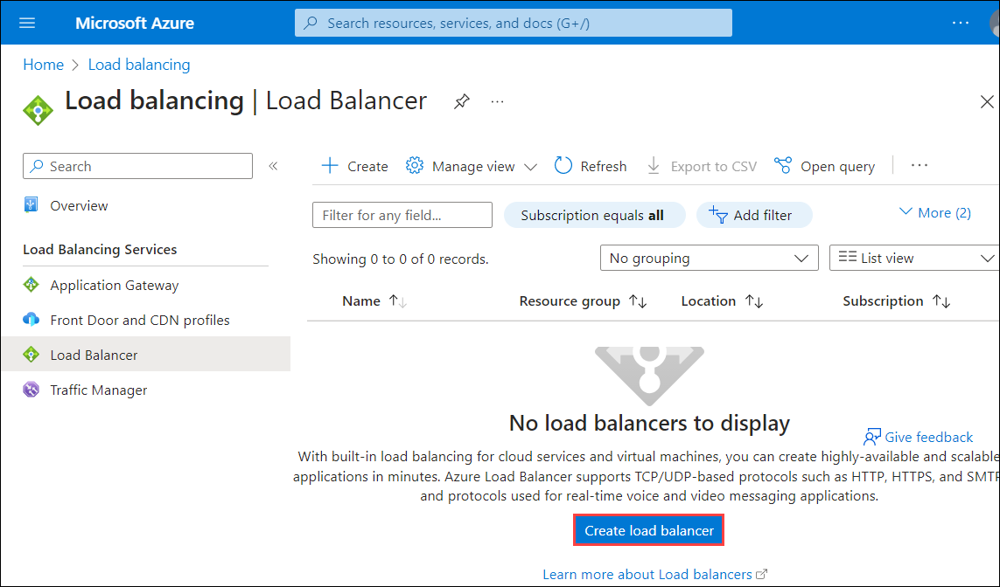
     
1. From the **Basics** tab of the **Create load balancer** blade, specify the following settings:

   - Subscription: Select your **Azure subscription (1)**

   - Resource group: Select **az12001a-RG (2)** from the drop-down list.

   - Name: **az12001a-lb0 (3)**

   - Region: Choose **<inject key="Region" enableCopy="false"/> (4)**

   - SKU: **Standard (5)**
   
   - Type: **Internal (6)**
   
   - Click on **Next: Frontend IP Configuration (7)**
     
    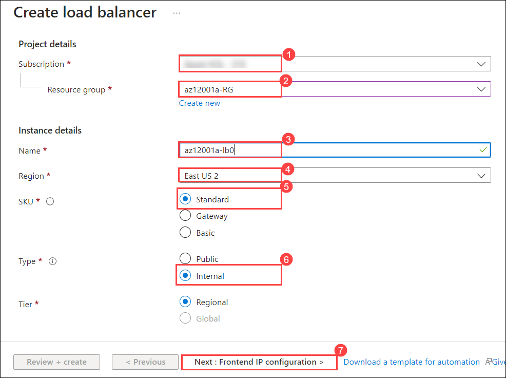
   
1. On the **Frontend IP configuration** screen, click **Add a frontend IP configuration (1)** and follow the below instructions:

   - Name: Enter **frontend1 (1)**
   
   - Virtual network: Select **az12001a-RG-vnet (2)**

   - Subnet: Select **subnet-0 (3)**

   - IP address assignment: Choose **Static (4)**

   - IP address: Enter **192.168.0.240 (5)**

   - Availability zone: Choose **Zone redundant (6)**

   -  Click on **Add (7)**

     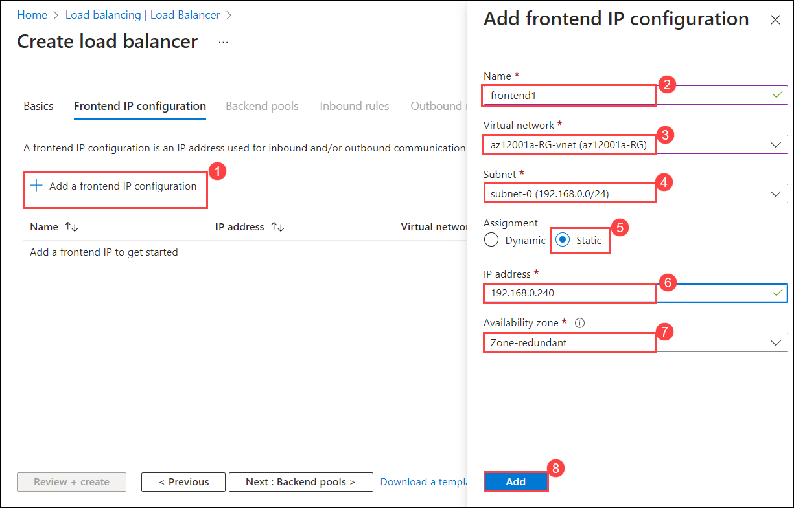

1. Select **Review + create**

    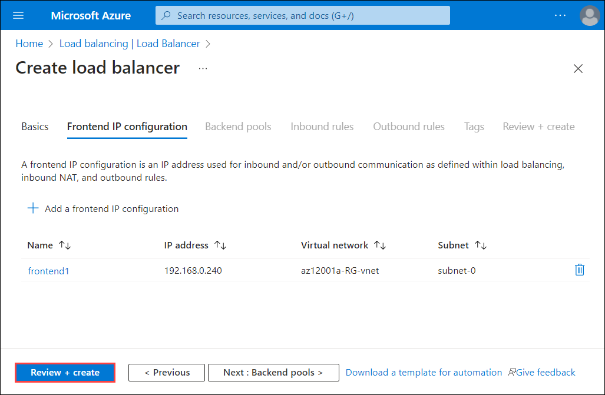
    
1. Review the configuration and click on **Create**.

    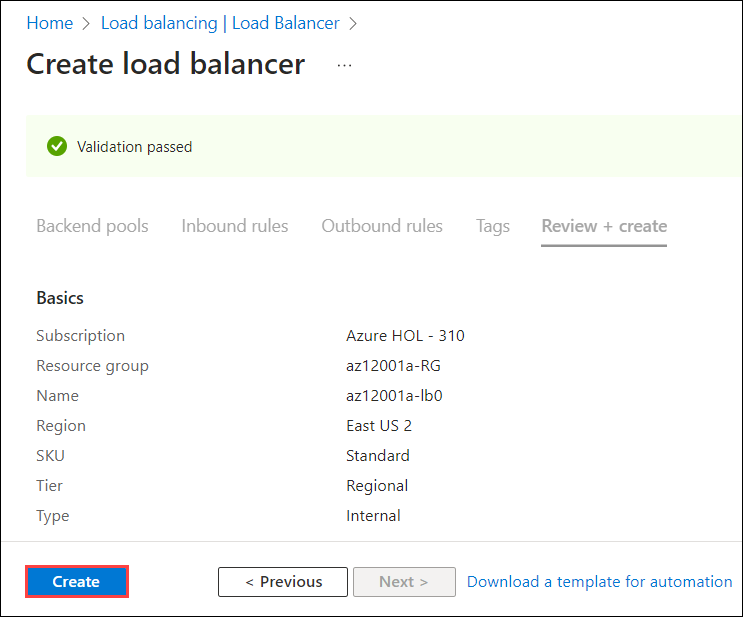

   > **Note**: Wait until the load balancer is provisioned. This should take less than a minute. 

1. Once the deployment is done, click on **Go to resource**.

    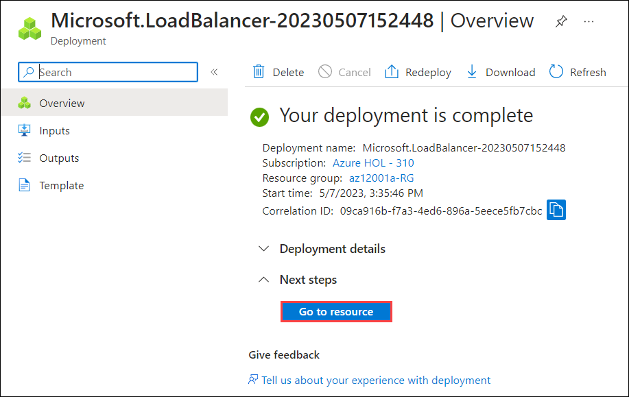
   
1. On the **az12001a-lb0** blade, select **Backend pools (1)**, click on **+ Add (2)**. 

    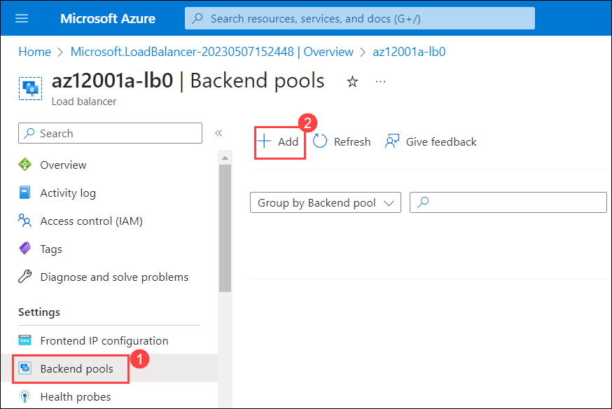
    
1. On the **Add backend pool** specify the following settings:

   - Name: **az12001a-lb0-bepool (1)**

   - Virtual network: **az12001a-RG-vnet (2)**

   - Backend Pool Configuration: Choose **IP address (3)**

   - IP address: Select **192.168.0.4 (4)** Resource name: **az12001a-vm0**

   - IP address: Select **192.168.0.5 (5)** Resource name: **az12001a-vm1**

   - Click on **Save (6)**

     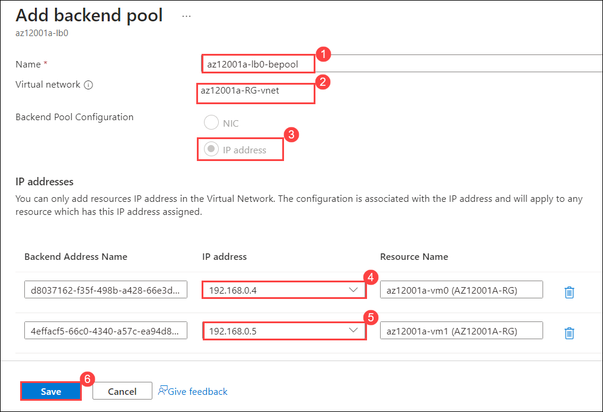
    
1. On the **az12001a-lb0** blade, select **Health probes (1)** select **+ Add (2)**.

    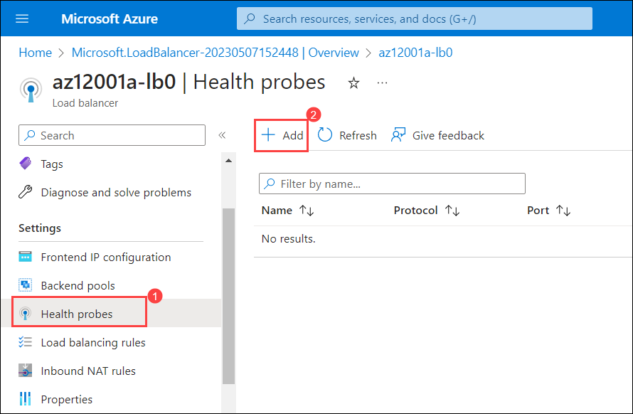
    
1. On the **Add health probe** blade, specify the following the below instructions:

   - Name: **az12001a-lb0-hprobe (1)**

   - Protocol: **TCP (2)**

   - Port: **62500 (3)**

   - Interval: **5 (4)** *seconds*

   - click on **Add (5)**

    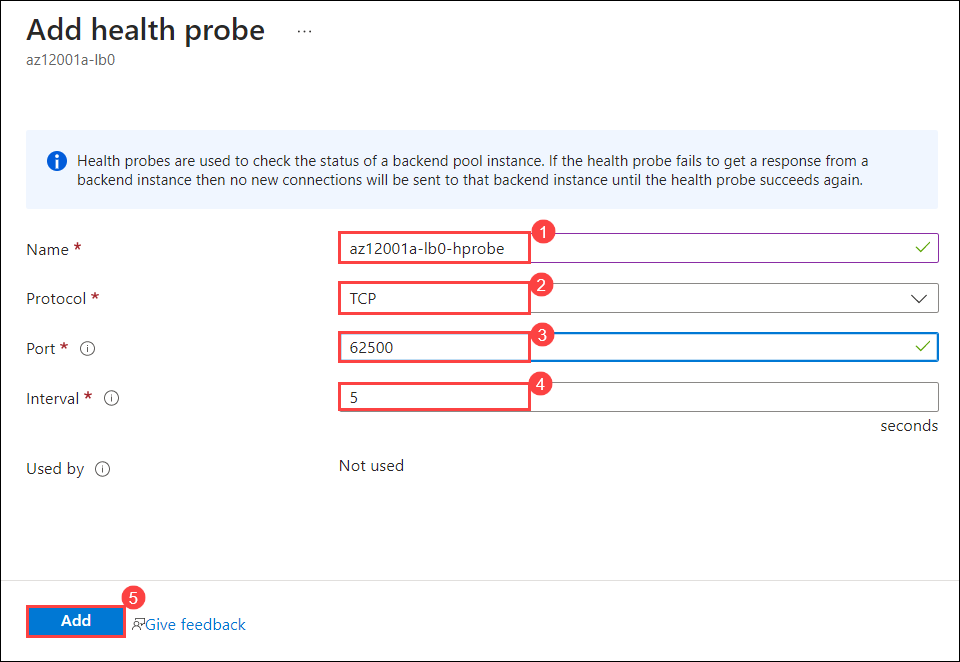


12. On the **az12001a-lb0** blade, select **Load balancing rules (1)**, select **+ Add (2)**.

     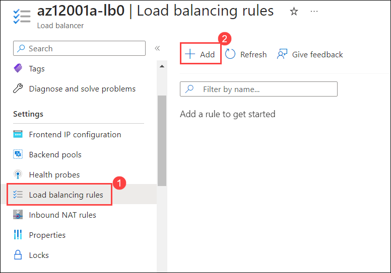

13. On the **Add load balancing rule** blade, specify the following settings:

   - Name: Enter **az12001a-lb0-lbruleAll (1)**

   - IP Version: Choose **IPv4 (2)**

   - Frontend IP address: Select **192.168.0.240 (LoadBalancerFrontEnd) (3)** form the drop-down list

   - Backend pool: Select **az12001a-lb0-bepool (2 virtual machines) (4)** from the drop-down list
   
   - High availability ports : **Check the box (5)**

   - Health probe: Select **az12001a-lb0-hprobe (TCP:62500) (6)** from the drop-down list

   - Session persistence: **None (7)**

   - Idle timeout (minutes): **4 (8)**

   - Enable TCP reset: **Uncheck the box (9)**

   - Enable Floating IP : **Check the box (10)**

   -  Click on **Save (11)**.

    [](../images/1.md/addlbrules.png)

## Task 3: Create and configure Azure Load Balancers handling outbound traffic

1. In the Azure Portal, start a Bash session in Cloud Shell. 

1. In the Cloud Shell pane, run the following command to set the value of the variable `RESOURCE_GROUP_NAME` to the name of the resource group containing the resources you provisioned in the first exercise of this lab:

   ```cli
   RESOURCE_GROUP_NAME='az12001a-RG'
   ```

1. In the Cloud Shell pane, run the following command to create the public IP address to be used by the second load balancer:

   ```cli
   LOCATION=$(az group list --query "[?name == '$RESOURCE_GROUP_NAME'].location" --output tsv)

   PIP_NAME='az12001a-lb1-pip'

   az network public-ip create --resource-group $RESOURCE_GROUP_NAME --name $PIP_NAME --sku Standard --location $LOCATION
   ```

1. In the Cloud Shell pane, run the following command to create the second load balancer:

   ```cli
   LB_NAME='az12001a-lb1'

   LB_BE_POOL_NAME='az12001a-lb1-bepool'

   LB_FE_IP_NAME='az12001a-lb1-fe'

   az network lb create --resource-group $RESOURCE_GROUP_NAME --name $LB_NAME --sku Standard --backend-pool-name $LB_BE_POOL_NAME --frontend-ip-name $LB_FE_IP_NAME --location $LOCATION --public-ip-address $PIP_NAME
   ```

1. In the Cloud Shell pane, run the following command to create the outbound rule of the second load balancer:

   ```cli
   LB_RULE_OUTBOUND='az12001a-lb1-ruleoutbound'

   az network lb outbound-rule create --resource-group $RESOURCE_GROUP_NAME --lb-name $LB_NAME --name $LB_RULE_OUTBOUND --frontend-ip-configs $LB_FE_IP_NAME --protocol All --idle-timeout 4 --outbound-ports 1000 --address-pool $LB_BE_POOL_NAME
   ```

1. Close the Cloud Shell pane.

1. In the Azure portal, navigate to the blade displaying the properties of the newly created Azure Load Balancer **az12001a-lb1**.
   
      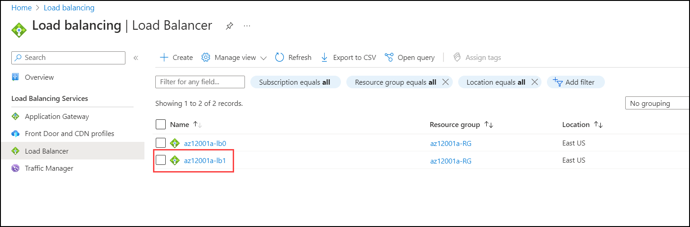

1. On the **az12001a-lb1** blade, click **Backend pools**.

1. On the **az12001a-lb1 \| Backend pools** blade, click **az12001a-lb1-bepool**.

1. On the **az12001a-lb1-bepool** blade, specify the following settings and click **Save**:

   - Virtual network: **az12001a-RG-vnet**

   - Virtual machine: **az12001a-vm0**  IP Configuration: **ipconfig1 (192.168.0.4)**

   - Virtual machine: **az12001a-vm1**  IP Configuration: **ipconfig1 (192.168.0.5)**
   
        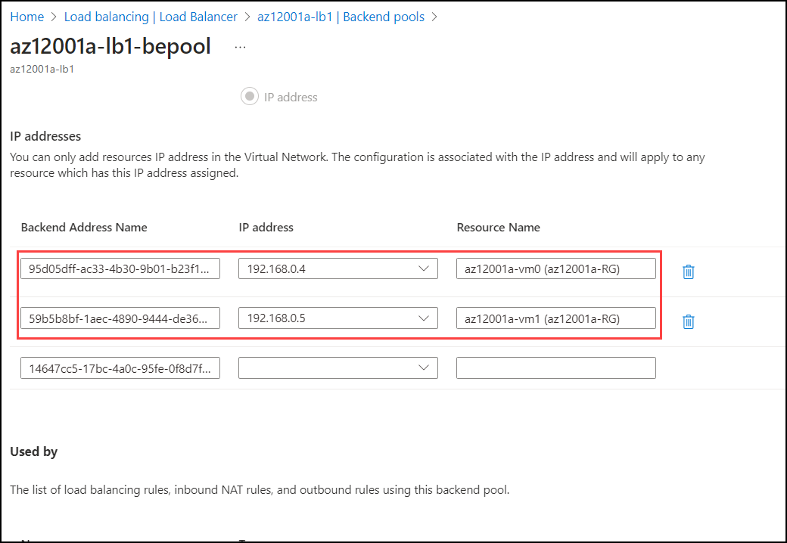
   

## Task 4: Deploy a jump host

   > **Note**: Since two clustered Azure VMs are no longer directly accessible from Internet, you will deploy an Azure VM running Windows Server 2019 Datacenter that will serve as a jump host. 

1. On Azure portal **Home** page, search for **Virtual machines (1)** and select it **(2)**.

    
    
1. On the **Virtual machines** blade, select **+ Create (1)** and, in the drop-down menu, select **Azure virtual machine (2)**.

    

1. On the **Basics** tab of the **Create a virtual machine** blade, specify the following settings and select **Next: Disks >** (leave all other settings with their default value):

   - Subscription: Select your **Azure subscription (1)**

   - Resource group: Select **az12001a-RG (2)** ftom the drop-down list.

   - Virtual machine name: Enter **az12001a-vm2 (3)**

   - Region: Choose **<inject key="Region" enableCopy="false"/> (4)**

   - Availability options: **No infrastructure redundancy required (5)**

   - Security type : Choose **Standard (6)**
   
   - Image: Select **Windows Server 2019 Datacenter - Gen 2 (7)**
  
   - Run with Azure Spot Instance: **Uncheck the box (8)**

    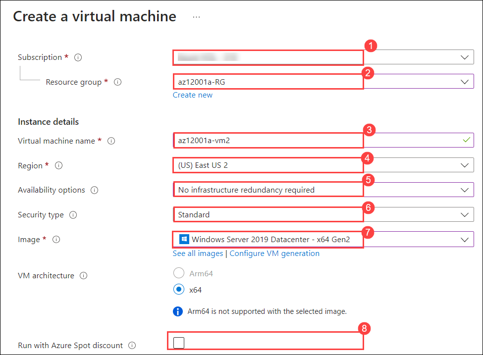

    - Size: Choose **Standard DS1 v2 (9)**

   - Username: Enter **Student (10)**

   - Password: Enter **Pa55w.rd1234 (11)**
   
   - Confirm Password : Enter **Pa55w.rd1234 (12)**

   - Public inbound ports: **Allow selected ports (13)**

   - Selected inbound ports: **RDP (3389) (14)**

   - Click on **Next : Disks > (15)**

    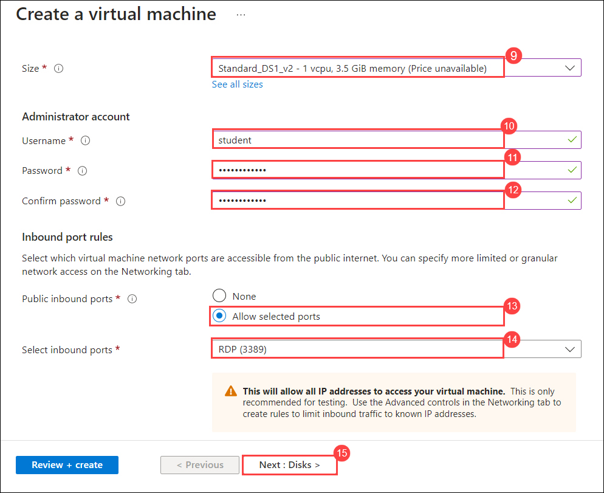

1. On the **Disks** tab of the **Create a virtual machine** blade, specify the following settings:

   - OS disk type: Select **Standard HDD (1)**

   - Encryption type: Select **Platform-managed key (2)**

   - Click on  **Next: Networking > (3)** 
   
   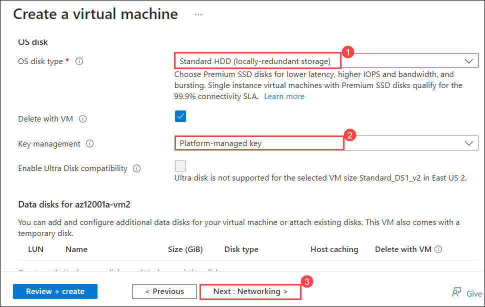

1. On the **Networking** tab of the **Create a virtual machine** blade, **Uncheck the box (1)** next to Enable accelerated networking and leave everything as default then click on  **Next: Management > (2)** 

    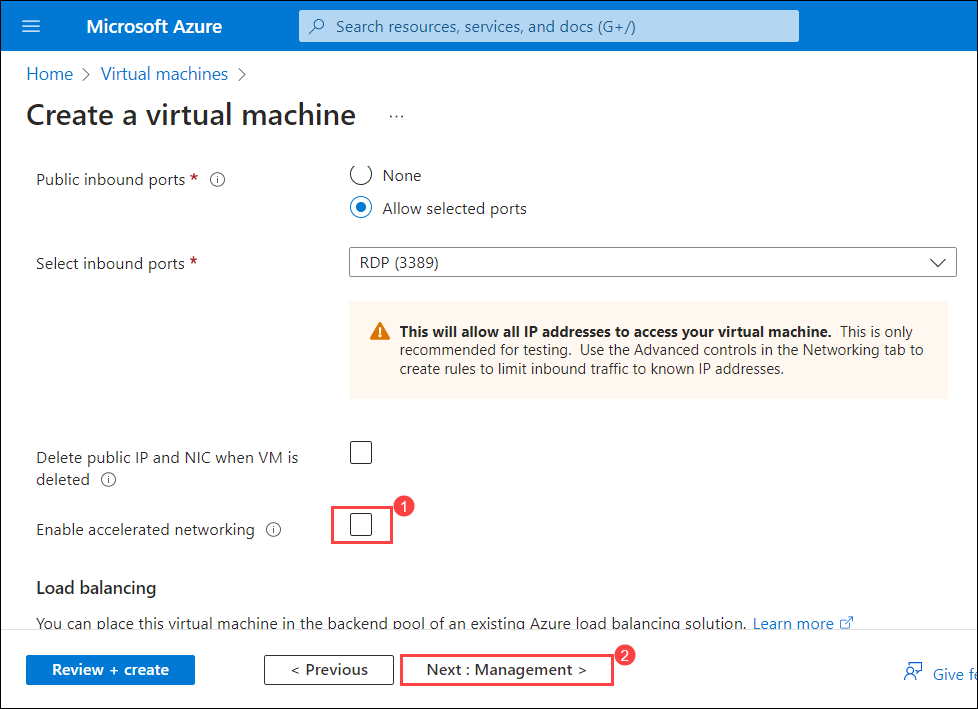

1. On the **Management** tab of the **Create a virtual machine** blade, choose **Manual updates (1)** for Guest OS updates (patch orchestration options) and leave all other settings with their default value, then click on **Next: Advanced > (2)**.

    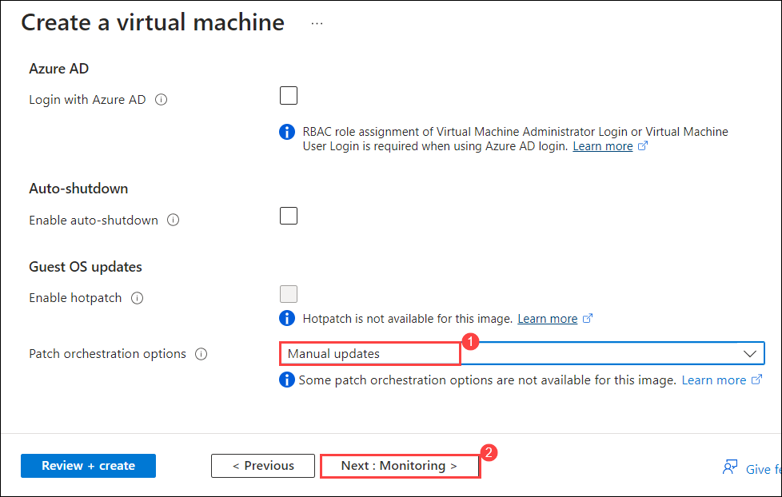

   
1. On the **Monitoring** tab of the **Create a virtual machine** blade, leave everything as default and click on **Review + Create**.

   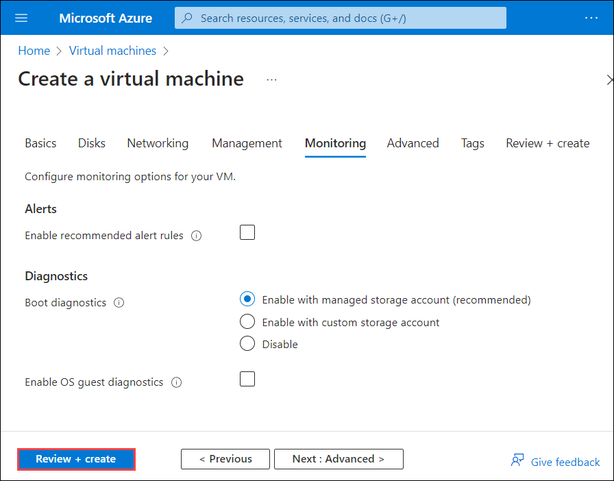
   
1. On the **Review + create** tab of the **Create a virtual machine** blade, select **Create**.

   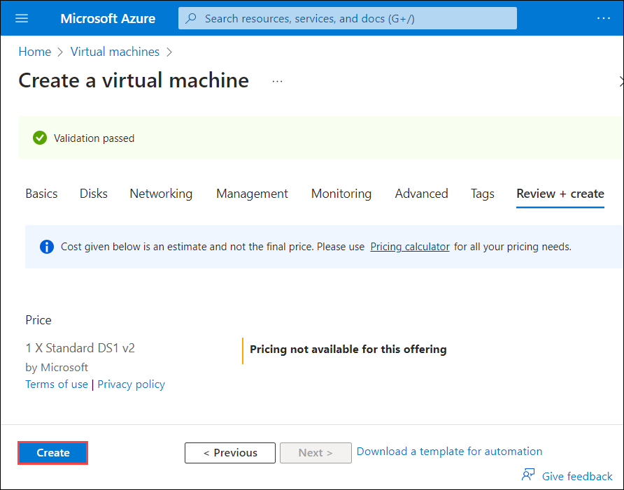
   
   > **Note**: Wait for the provisioning to complete. This should take less about 3 minutes.

1. Connect to the newly provisioned Azure VM via RDP. 

1. Within the RDP session to az12001a-vm2, download PuTTY from [**https://www.chiark.greenend.org.uk/~sgtatham/putty/latest.html**](https://www.chiark.greenend.org.uk/~sgtatham/putty/latest.html).

1. Ensure that you can establish SSH session to both az12001a-vm0 and az12001a-vm1 via their private IP addresses (192.168.0.4 and 192.168.0.5, respectively). 

> **Result**: After you completed this exercise, you have provisioned Azure network resources necessary to support highly available SAP HANA deployments


