# AZ 120 Module 1: Explore the foundations of IaaS for SAP on Azure
# Lab 1b: Implement Windows clustering on Azure VMs

Estimated Time: 120 minutes

All tasks in this lab are performed from the Azure portal (including the PowerShell Cloud Shell session)  

   > **Note**: When not using Cloud Shell, the lab virtual machine must have Az PowerShell module installed [**https://docs.microsoft.com/en-us/powershell/azure/install-az-ps-msi**](https://docs.microsoft.com/en-us/powershell/azure/install-az-ps-msi).

Lab files: none

## Scenario
  
In preparation for deployment of SAP NetWeaver on Azure, with SQL Server as the database management system, Adatum Corporation wants to explore the process of implementing clustering on Azure VMs running Windows Server 2022.

## Objectives
  
After completing this lab, you will be able to:

-   Provision Azure compute resources necessary to support highly available SAP NetWeaver deployments.

-   Configure operating system of Azure VMs running Windows Server 2022 to support a highly available SAP NetWeaver deployment.

-   Provision Azure network resources necessary to support highly available SAP NetWeaver deployments.

## Requirements

-   A Microsoft Azure subscription with the sufficient number of available DSv2 and Dsv3 vCPUs (one Standard_DS1_v2 VM with 1 vCPU and four Standard_D4s_v3 VMs with 4 vCPUs each) in the Azure region you intend to use for this lab

-   A lab computer with an Azure Cloud Shell-compatible web browser and access to Azure

> **Note**: Make sure that the Azure region you choose for deployment of your resources supports availability zones. For the list of such regions, refer to (https://docs.microsoft.com/en-us/azure/availability-zones/az-overview). Consider using **East US** or **East US2**.

## Exercise 1: Provision Azure compute resources necessary to support highly available SAP NetWeaver deployments

Duration: 50 minutes

In this exercise, you will deploy Azure infrastructure compute components necessary to configure Failover Clustering on Azure VMs running Windows Server 2022. This will involve deploying a pair of Active Directory domain controllers, followed by a pair of Azure VMs running Windows Server 2022. Each pair of the VMs will be placed in separate availability zones within the same virtual network. To automate the deployment of domain controllers, you will use an Azure Resource Manager QuickStart template available from <https://aka.ms/az120-1bdeploy>

### Task 1: Deploy a pair of Azure VMs running highly available Active Directory domain controllers by using a Bicep template

1.  Type **Deploy a custom template (1)** in the search box of the Azure portal menu, and select it **(2)**.

     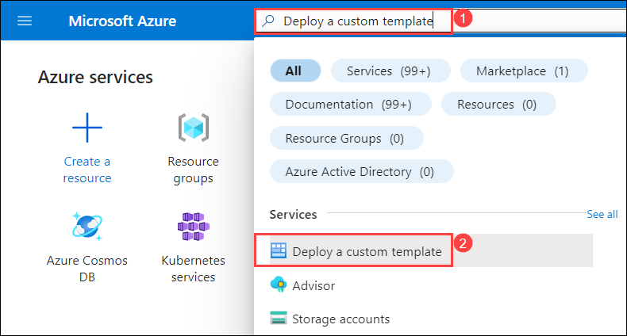

1.  From the **Custom deployment** blade, scroll down to **Quickstart template (disclaimer) (1)** and select the **application-workloads/active-directory/active-directory-new-domain-ha-2-dc-zones (2)**, from the drop-down list then click **Select template (3)**.

    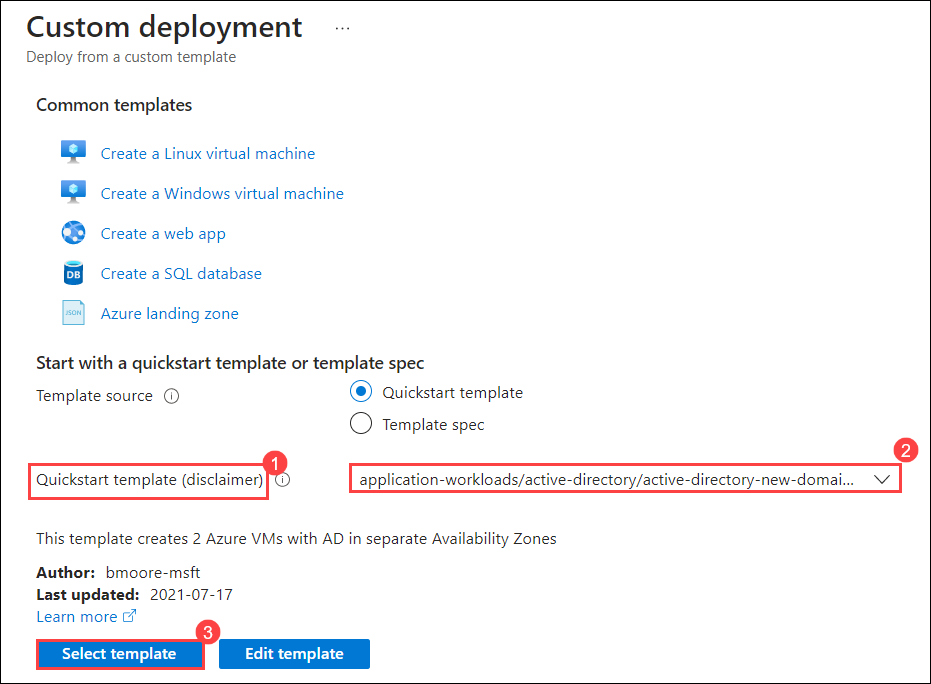
    

    > **Note**: Alternatively, you can launch the deployment by navigating to Azure Quickstart Templates page at <https://github.com/Azure/azure-quickstart-templates>, locating the template named **Create 2 new Windows VMs, a new AD Forest, Domain and 2 DCs in separate availability zones**, and initiating its deployment by clicking **Deploy to Azure** button.

1.  On the blade **Create a new AD Domain with 2 DCs using Availability Zones**, specify the following settings :

    -   Subscription: Select your **Azure subscription (1)**

    -   Resource group: Choose the resource group **az12001b-ad-RG (2)** form the drop-down list

    -   Location: Choose **<inject key="Region" enableCopy="false"/> (3)**

    -   Admin Username: Enter **Student (4)**

    -   Location:  Choose **<inject key="Region" enableCopy="false"/> (5)**

    -   Password: Enter **Pa55w.rd1234 (6)**

    -   Domain Name: Enter **adatum.com (7)**

    -   DnsPrefix: Enter **dns<inject key="Deployment ID" enableCopy="false"/> (8)**

    -   Vm Size: **Standard D2s_v3 (9)**

    -   _artifacts Location: Enter **https://raw.githubusercontent.com/Azure/azure-quickstart-templates/master/application-workloads/active-directory/active-directory-new-domain-ha-2-dc-zones/** **(10)**

    -   _artifacts Location Sas Token: Leave it as default **(11)**
    
    - Click on **Review + Create (12)**.
    
    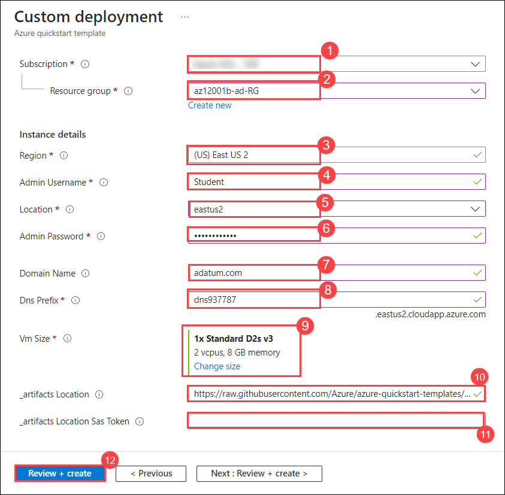

1. Review the configuration and click on **Create**.

    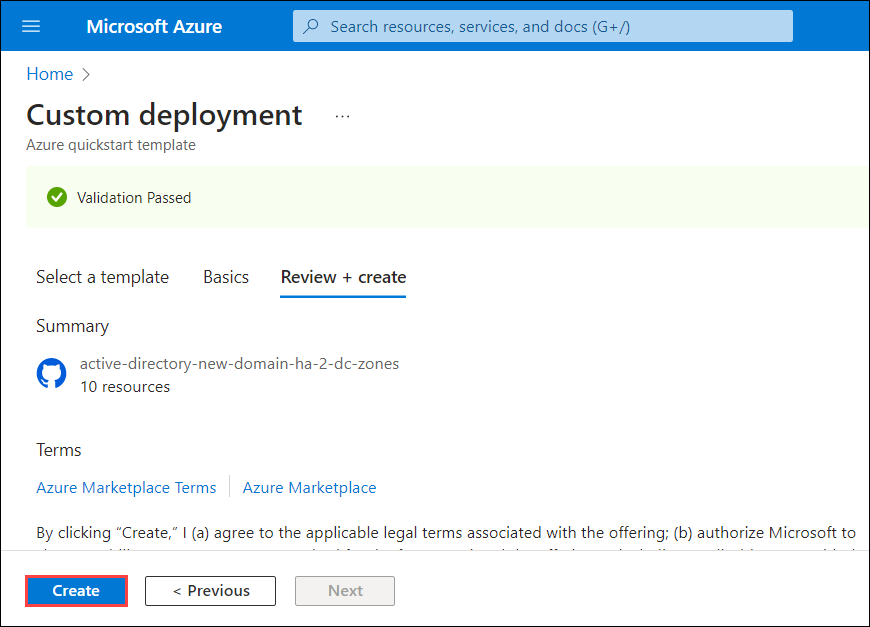

    > **Note**: The deployment should take about 35 minutes. Wait for the deployment to complete before you proceed to the next task.

    > **Note**: If the deployment fails with the **Conflict** error message during deployment of the CustomScriptExtension component, use the following steps  to remediate this issue:

    - in the Azure portal, on the **Deployment** blade, review the deployment details and identify the VM(s) where the installation of the CustomScriptExtension failed

    - in the Azure portal, navigate to the blade of the VM(s) you identified in the previous step, select **Extensions**, and from the **Extensions** blade, remove the CustomScript extension

    - in the Azure portal, navigate to the **az12001b-ad-RG** resource group blade, select **Deployments**, select the link to the failed deployment, and select **Redeploy**, select the target resource group (**az12001b-ad-RG**) and provide the password for the root account (**Pa55w.rd1234**).


### Task 2: Deploy a pair of Azure VMs running Windows Server 2022 in a new availability set.

1. On Azure portal **Home** page, search for **Virtual machines (1)** and select it **(2)**.

    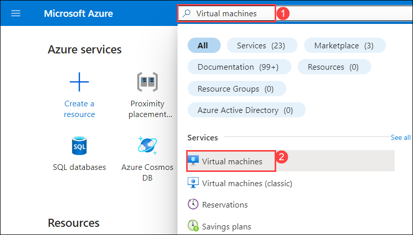
    
1. On the **Virtual machines** blade, select **+ Create (1)** and, in the drop-down menu, select **Azure virtual machine (2)**.

    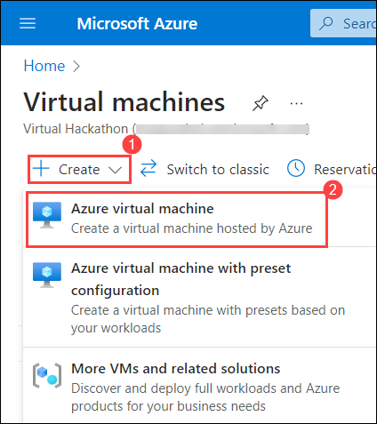

1. On the **Basics** tab of the **Create a virtual machine** blade, specify the following settings :

   - Subscription: Select your **Azure subscription (1)**

   - Resource group: Select **az12001b-cl-RG (2)** ftom the drop-down list.
   
   - Virtual machine name: Enter **az12001b-cl-vm0 (3)** 

   - Region: Choose **<inject key="Region" enableCopy="false"/> (4)**

   - Availability options: Select **Availability zone (5)**

   - Availability zone: Choose **Zone 1 (6)**

   - Security type : Choose **Standard (7)**
   
   - Image: Select **Windows Server 2022 Datacenter: Azure Edition - Gen2 (8)**

     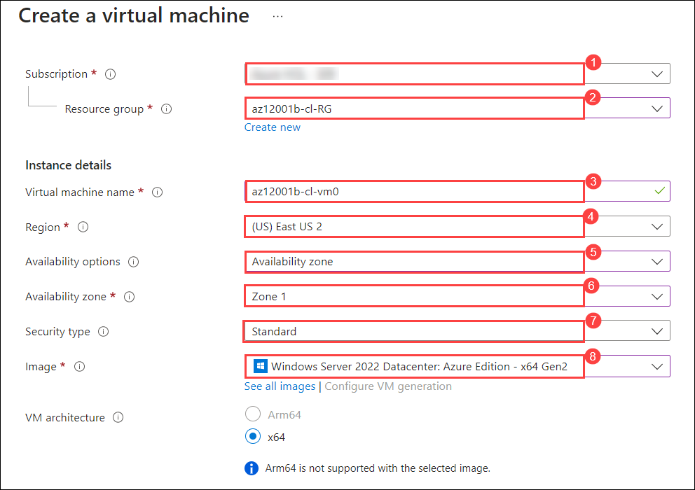
   
   - Size: Select **Standard D4s v3 (9)** from drop-down list

   - Username: Enter **Student (10)**

   - Password: Enter **Pa55w.rd1234(11)**

   - Confirm Password : Enter **Pa55w.rd1234(12)**
   
   - Public inbound ports: **Allow selected ports (13)**

   - Select inbound ports: **RDP (3389) (14)**

   - Would you like to use an existing Windows Server license?: **No (15)** 
    
   - Click on **Next : Disks> (16)**

    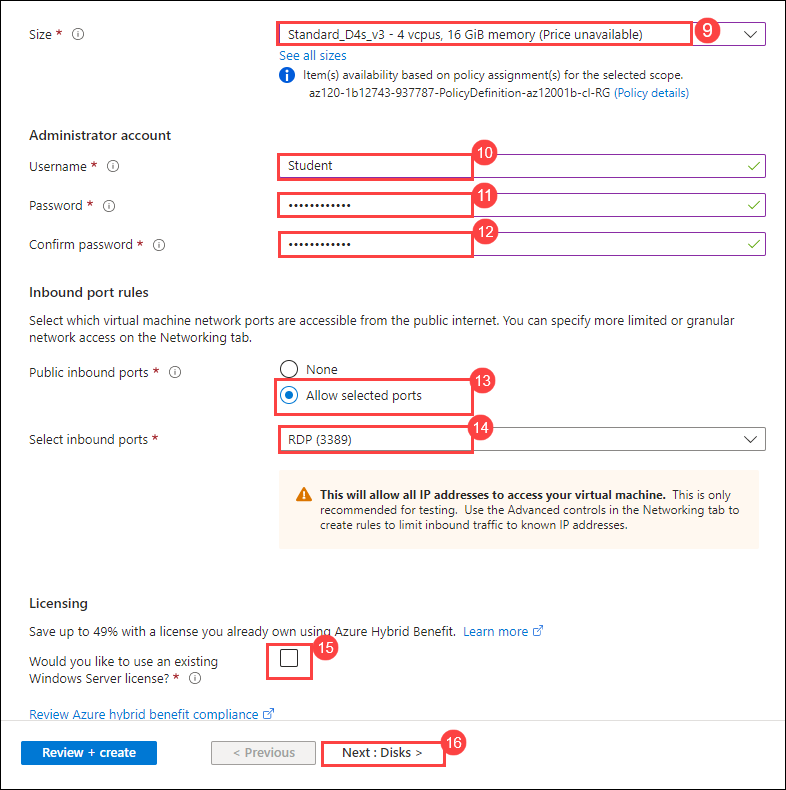
    
 1. On **Disks** tab of **Create a virtual machine** blade specify the following instructions: 
    
    - OS disk type: **Premium SSD (1)**

    - Select **Next:Networking> (2)**

    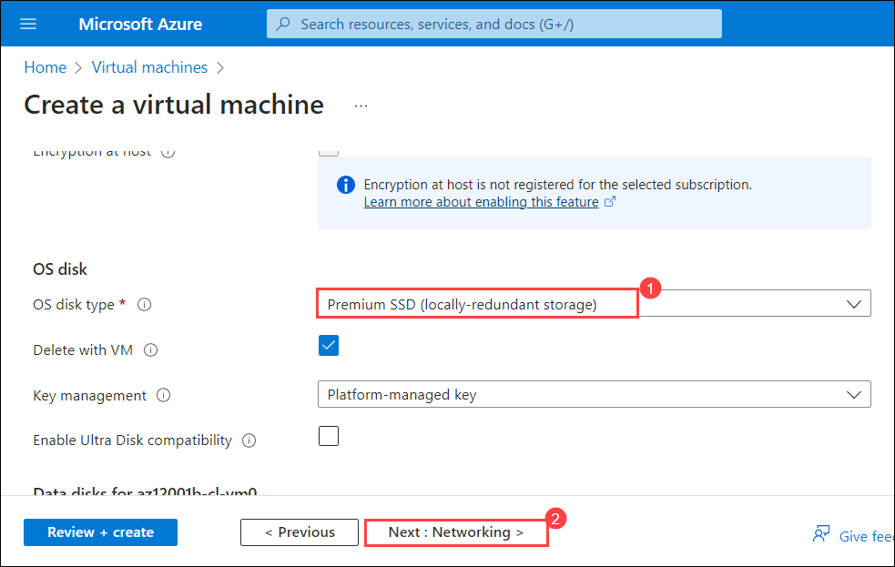

 1. On **Networking** tab of **Create a virtual machine** blade specify the following instructions: and select **Next:Managemet>**.

    - Virtual network: **adVNET**

    - Subnet name: Click on **Manage subnet configuration (2)**. 
        
       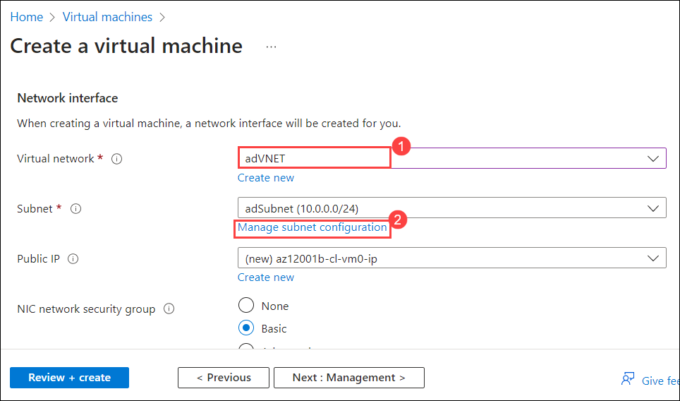

    - Click on **+ Subnet (3)**

    - Name : Enter **clSubnet (4)**
   
    - Subnet address range: Enter **10.0.1.0/24 (5)**

    - Click on **Save (6)**

       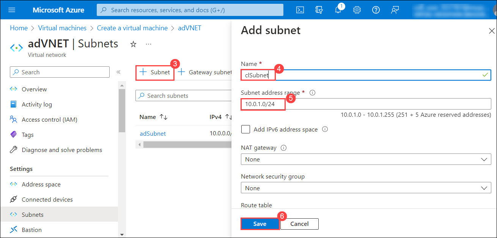
    
    - Navigate back to Virtual machine tab and follow the below instructions: 
    
       -   Public IP address: **az12001b-cl-vm0-ip (7)**

       -   NIC network security group: **Basic (8)**

       -   Public inbound ports: Select **Allow selected ports (9)**

       -   Select inbound ports: Select **RDP (3389) (10)**

       -   Enable Accelerated networking: **Check the box (11)**

       -   Click on **Next : Management > (12)**

       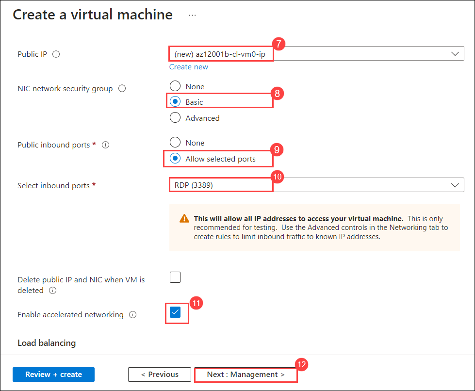

 1. On **Management** tab of **Create a virtual machine** blade, choose Patch orchestration options as **Manual Updates (1)** and click on **Next : Monitoring > (2)**

     

 1. On **Monitoring** tab of **Create a virtual machine** blade specify the following:

    -   Boot diagnostics: **Disable (1)**
    
    -   Click on **Review + Create (2)**

    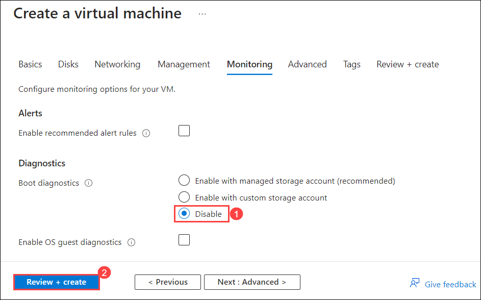
    
 1. Review the configuration and click on **Create**.

    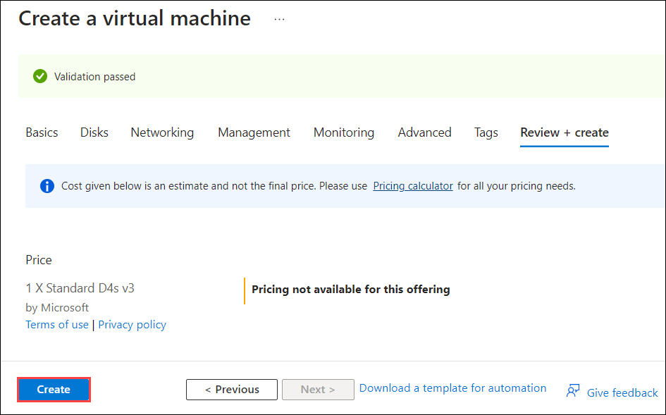

    > **Note :** Do not wait for the provisioning to complete but continue to the next step.

1. Navigate back to the Azure portal **Home** page, search for **Virtual machines (1)** and select it **(2)**.

    
    
1. On the **Virtual machines** blade, select **+ Create (1)** and, in the drop-down menu, select **Azure virtual machine (2)**.

    

1. On the **Basics** tab of the **Create a virtual machine** blade, specify the following settings :

   - Subscription: Select your **Azure subscription (1)**

   - Resource group: Select **az12001b-cl-RG (2)** ftom the drop-down list.
   
   - Virtual machine name: Enter **az12001b-cl-vm1 (3)** 

   - Region: Choose **<inject key="Region" enableCopy="false"/> (4)**

   - Availability options: Select **Availability zone (5)**

   - Availability zone: Choose **Zone 1 (6)**

   - Security type : Choose **Standard (7)**
   
   - Image: Select **Windows Server 2022 Datacenter: Azure Edition - Gen2 (8)**

     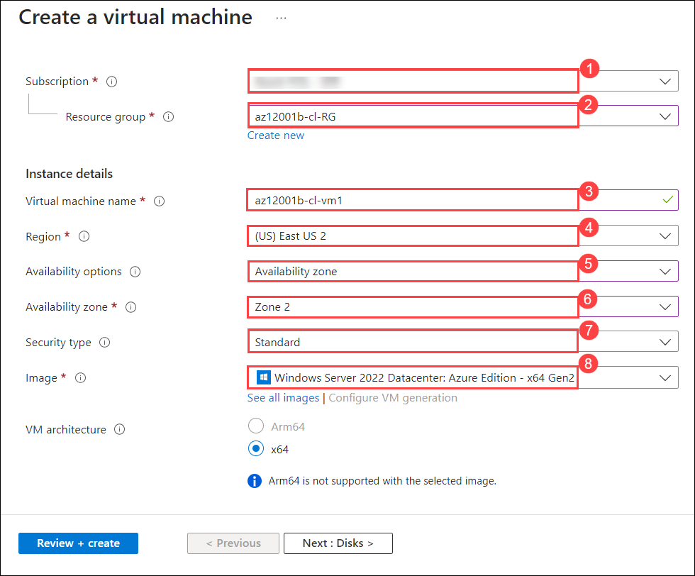
   
   - Size: Select **Standard D4s v3 (9)** from drop-down list

   - Username: Enter **Student (10)**

   - Password: Enter **Pa55w.rd1234(11)**

   - Confirm Password : Enter **Pa55w.rd1234(12)**
   
   - Public inbound ports: **Allow selected ports (13)**

   - Select inbound ports: **RDP (3389) (14)**

   - Would you like to use an existing Windows Server license?: **No (15)** 
    
   - Click on **Next : Disks> (16)**

    
    
 1. On **Disks** tab of **Create a virtual machine** blade specify the following instructions: 
    
    - OS disk type: **Premium SSD (1)**

    - Select **Next:Networking> (2)**

    

 1. On **Networking** tab of **Create a virtual machine** blade specify the following instructions: and select **Next:Managemet>**.

    - Virtual network: Select **adVNET (1)**

    - Subnet name: Select **clSubnet (2)**
     
    - Public IP address: **az12001b-cl-vm1-ip (3)**

    - NIC network security group: **Basic (4)**

    - Public inbound ports: Select **Allow selected ports (5)**

    - Select inbound ports: Select **RDP (3389) (6)**

    - Enable Accelerated networking: **Check the box (7)**

    - Click on **Next : Management > (8)**

       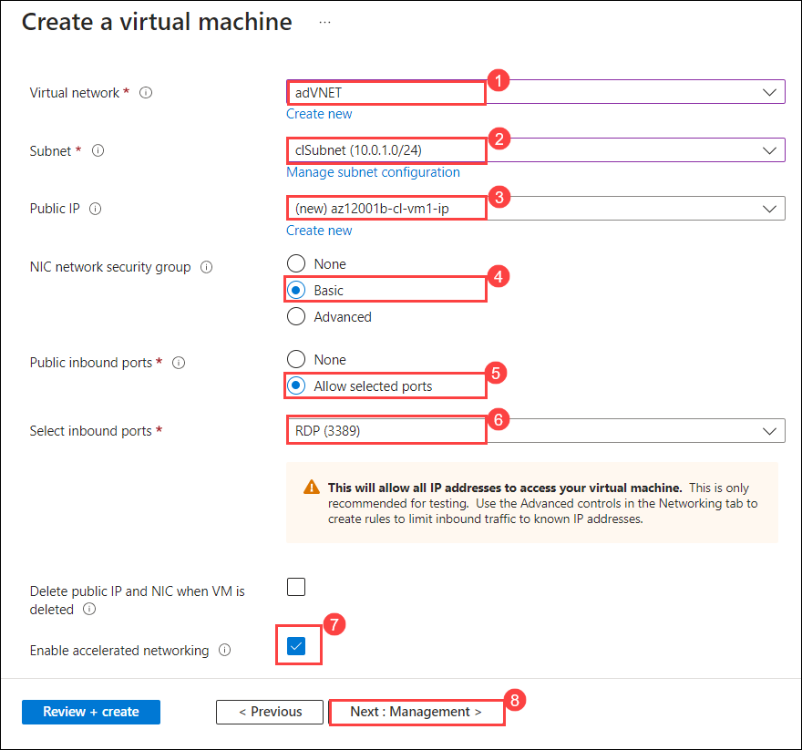

 1. On **Management** tab of **Create a virtual machine** blade, choose Patch orchestration options as **Manual Updates (1)** and click on **Next : Monitoring > (2)**

     

 1. On **Monitoring** tab of **Create a virtual machine** blade specify the following:

    -   Boot diagnostics: **Disable (1)**
    
    -   Click on **Review + Create (2)**

    
    
 1. Review the configuration and click on **Create**.

    


1.  Wait for the provisioning to complete. This should take a few minutes.

### Task 3: Create and configure Azure VMs disks

1.  In the Azure Portal, start a PowerShell session in Cloud Shell. 

1. In the Cloud Shell pane, run the following command to set the value of the variable `$resourceGroupName` to the name of the resource group containing the resources you provisioned in the previous task:

    ```
    $resourceGroupName = 'az12001b-cl-RG'
    ```

1.  In the Cloud Shell pane, run the following command to create the first set of 4 managed disks that you will attach to the first Azure VM you deployed in the previous task:

    >**Note**: Replace <Azure_region> with region where you deployment **az12001b-cl-vm0** Vm.
    
    ```
    $location = '<Azure_region>'
    $zone = (Get-AzVM -ResourceGroupName $resourceGroupName -Name 'az12001b-cl-vm0').Zones
    $diskConfig = New-AzDiskConfig -Location $location -DiskSizeGB 128 -AccountType Premium_LRS -OsType Windows -CreateOption Empty -Zone $zone

    for ($i=0;$i -lt 4;$i++) {New-AzDisk -ResourceGroupName $resourceGroupName -DiskName az12001b-cl-vm0-DataDisk$i -Disk $diskConfig}
    ```

1.  In the Cloud Shell pane, run the following command to create the second set of 4 managed disks that you will attach to the second Azure VM you deployed in the previous task:

    >**Note**: Replace <Azure_region> with region where you deployment **az12001b-cl-vm1** Vm.
    
    ```
    $location = '<Azure_region>'
    $zone = (Get-AzVM -ResourceGroupName $resourceGroupName -Name 'az12001b-cl-vm1').Zones
    
    $diskConfig = New-AzDiskConfig -Location $location -DiskSizeGB 128 -AccountType Premium_LRS -OsType Windows -CreateOption Empty -Zone $zone
    
    for ($i=0;$i -lt 4;$i++) {New-AzDisk -ResourceGroupName $resourceGroupName -DiskName az12001b-cl-vm1-DataDisk$i -Disk $diskConfig}
    ```

1.  In the Azure portal, navigate to the blade of the first Azure VM you provisioned in the previous task (**az12001b-cl-vm0**).

1.  From the **az12001b-cl-vm0** blade, navigate to the **az12001b-cl-vm0 - Disks** blade.

1.  From the **az12001b-cl-vm0 - Disks** blade, attach data disks with the following settings to az12001b-cl-vm0:

    -   LUN: **0**

    -   Disk name: **az12001b-cl-vm0-DataDisk0**

    -   Resource group: *the name of the resource group you used when deploying the pair of **Windows Server 2022 Datacenter** Azure VMs in the previous task*

    -   HOST CACHING: **Read-only**

1.  Repeat the previous step to attach the remaining 3 disks with the prefix **az12001b-cl-vm0-DataDisk** (for the total of 4). Assign the LUN number matching the last character of the disk name. For the last disk (LUN **3**), set HOST CACHING to **None**.

1.  Save your changes.

     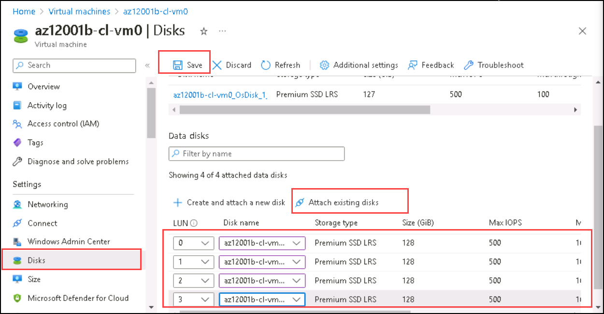

1.  In the Azure portal, navigate to the blade of the second Azure VM you provisioned in the previous task (**az12001b-cl-vm1**).

1.  From the **az12001b-cl-vm1** blade, navigate to the **az12001b-cl-vm1 - Disks** blade.

1.  From the **az12001b-cl-vm1 - Disks** blade, attach data disks with the following settings to az12001b-cl-vm1:

    -   LUN: **0**

    -   Disk name: **az12001b-cl-vm1-DataDisk0**

    -   Resource group: *the name of the resource group you used when deploying the pair of **Windows Server 2022 Datacenter** Azure VMs in the previous task*

    -   HOST CACHING: **Read-only**

1.  Repeat the previous step to attach the remaining 3 disks with the prefix **az12001b-cl-vm1-DataDisk** (for the total of 4). Assign the LUN number matching the last character of the disk name. For the last disk (LUN **3**), set HOST CACHING to **None**.

1.  Save your changes. 

> **Result**: After you completed this exercise, you have provisioned Azure compute resources necessary to support highly available SAP NetWeaver deployments.


## Exercise 2: Configure operating system of Azure VMs running Windows Server 2022 Datacenter to support a highly available SAP NetWeaver installation

Duration: 40 minutes

### Task 1: Join Windows Server 2022 Datacenter VMs to the Active Directory domain.

   > **Note**: Before you start this task, ensure that the template deployment you initiated in the last task of the previous exercise has successfully completed. 

1.  In the Azure Portal, navigate to the blade of the virtual network **adVNET**, which was provisioned automatically in the first exercise of this lab.

1.  Display the **adVNET - DNS servers** blade and notice that the virtual network is configured with the private IP addresses assigned to the domain controllers deployed in the first exercise of this lab as its DNS servers.

1.  In the Azure Portal, start a PowerShell session in Cloud Shell. 

1. In the Cloud Shell pane, run the following command to set the value of the variable `$resourceGroupName` to the name of the resource group containing the pair of **Windows Server 2022 Datacenter: Azure Edition - Gen2** Azure VMs you provisioned in the previous exercise:

    ```
    $resourceGroupName = 'az12001b-cl-RG'
    ```

1.  In the Cloud Shell pane, run the following command to join the Windows Server 2022 Azure VMs you deployed in the second task of the previous exercise to the **adatum.com** Active Directory domain (replace the `<username>` and `<password>` placeholders with the name and password of the administrative user account you specified when deploying the Bicep template in the first exercise of this lab):

    >**Note**: Replace <Azure_region> with the region where you deployed both the VM's in previous task.

    ```
    $location = '<Azure_region>'

    $settingString = '{"Name": "adatum.com", "User": "adatum.com\\<username>", "Restart": "true", "Options": "3"}'

    $protectedSettingString = '{"Password": "<password>"}'

    $vmNames = @('az12001b-cl-vm0','az12001b-cl-vm1')

    foreach ($vmName in $vmNames) { Set-AzVMExtension -ResourceGroupName $resourceGroupName -ExtensionType 'JsonADDomainExtension' -Name 'joindomain' -Publisher "Microsoft.Compute" -TypeHandlerVersion "1.0" -Vmname $vmName -Location $location -SettingString $settingString -ProtectedSettingString $protectedSettingString }
    ```

1.  Wait for the script to complete before proceeding to the next task.


### Task 2: Configure storage on Azure VMs running Windows Server 2022 to support a highly available SAP NetWeaver installation.

1.  In the Azure Portal, navigate to the blade of the virtual virtual machine **az12001b-cl-vm0**, which you provisioned in the first exercise of this lab.

1.  From the **az12001b-cl-vm0** blade, connect to the virtual machine guest operating system by using Remote Desktop. When prompted to authenticate, provide the credentials of the administrative user account you specified when deploying the Bicep template in the first exercise of this lab. 

    > **Note**: Make sure to sign in using the **ADATUM** domain account, rather than the operating system level account (i.e. ensure that the user name is preceded by the **ADATUM\\** prefix.

1.  Within the RDP session to az12001b-cl-vm0, in Server Manager, navigate to the **File and Storage Services** -> **Servers** node. 

1.  Navigate to the **Storage Pools** view and verify that you see all the disks you attached to the Azure VM in the previous exercise.

1.  From the top right corner select **TASKS** in dropdown click on **New storage pool**.

    .png)

1.  Use the **New Storage Pools Wizard** to create a new storage pool with the following settings:

    - On **Before you begin** Wizard - select **Next>**

    - On **Storage Pool Name** Wizard
      
        - Name : enter **Data Storage Pool**

    - On **Physical Disks** Wizard
 
        - Select the 3 disks with disk numbers corresponding to the first three LUN numbers (0-2) and set their allocation to **Automatic**

    > **Note**: Use the entry in the **Chassis** column to identify the **LUN** number.

    -  On **Confirmation** Wizard
         
        - Review and click on **Create**

    - On **Result** Wizard, wait untill Storage pool successfully complete and click on **Close**

      .png)


1.  Use the **New Virtual Disk Wizard** to create a new virtual disk with the following settings:

1.  Click on **Storage pools** from left pane then select newly created storage pool and under **Virtual Disks** from **TASKS** dropdown select **New Virtual Disks**

    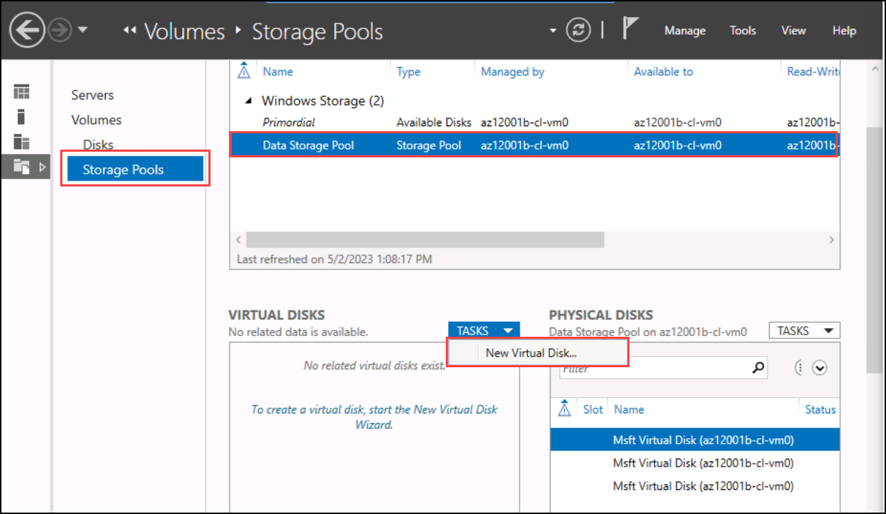
    
1. Select the newly created **Storage pool** as shown in below image and click on **Next**.
    
    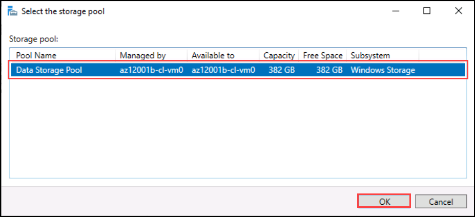
    
    -  On **Before you begin** Wizard - select **Next>**

    -  On **Virtual Disk Name** Wizard

         -  Name: **Data Virtual Disk**

    -  On **Enclosure Awareness** Wizard - select **Next>**

    -  On **Storage Layout** Wizard
    
         - Select Layout: **Simple**

    -   On **Provisioning** Wizard
      
         - Select Provisioning type : **Fixed**

    -   On **Size** Wizard
       
         - Size: **Maximum size**

    -   On **Confirmation selections** Wizard click on create 

    -   On **Result** Wizard, wait untill new virtual disk successfully complete and click on close.

	 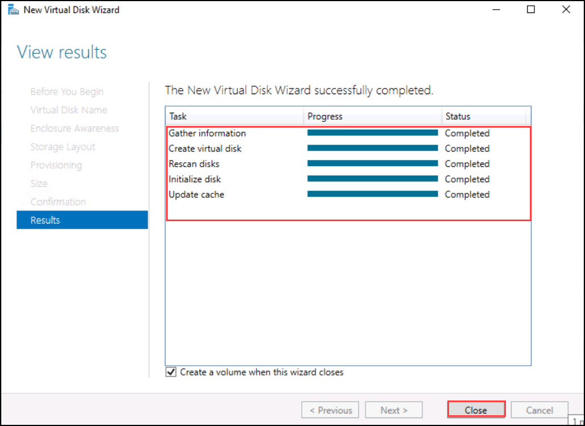

1.  Use the **New Volume Wizard** to create a new volume with the following settings:

    -   On **Before you begin** Wizard - select **Next>**
    
    -   Server and Disk: *accept the default values*

    -   Size: *accept the default values*
    
    -   On **Drive letter and folder** Wizard
    
         -  Drive letter: **M**
        
    -   On **File system** Wizard
    
         - File system: **ReFS**

         - Allocation unit size: **Default**

         - Volume label: **Data**

    -   On **Confirmation selections** Wizard click on create 

    -   On **Result** Wizard wait untill new volume successfully complete and click on close.

	 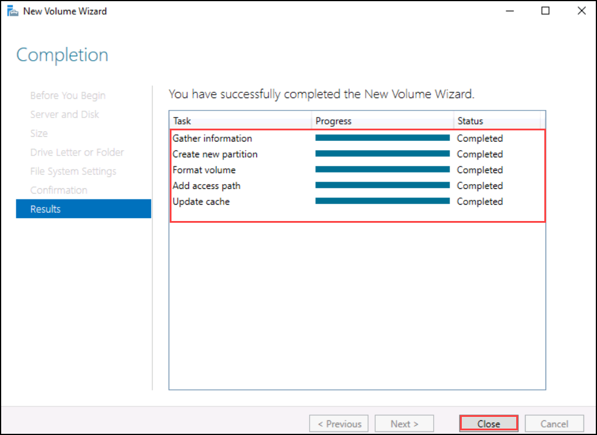

1.  Back in the **Storage Pools**, from the top right corner select **TASKS** in dropdown click on **New storage pool**.

1.  Use the **New Storage Pools Wizard** to create a new storage pool with the following settings:

    - On **Before you begin** Wizard - select **Next>**

    - On **Storage Pool Name** Wizard
      
        - Name : enter **Log Storage Pool**

    - On **Physical Disks** Wizard
 
        - *select the last of 4th  disks and set its allocation to* **Automatic**  

    -  On **Confirmation** Wizard
         
        - Review and click on **Create**

    - On **Result** Wizard wait, untill Storage pool successfully complete and click on **Close**

1.  Back on **Storage pools**, under **Virtual Disks** from **TASKS** dropdown select **New Virtual Disks**

1.  Use the **New Virtual Disk Wizard** to create a new virtual disk with the following settings:
 
    -  On **Before you begin** Wizard - select **Next>**
  
    -  On **Virtual Disk Name** Wizard

        - Virtual Disk Name: **Log Virtual Disk**

    -  On **Enclosure Awareness** Wizard - select **Next>**

    -  On **Storage Layout** Wizard
    
        - Storage Layout: **Simple**

    -  On **Provisioning** Wizard
      
         - Select Provisioning type : **Fixed**

    -   On **Size** Wizard
       
         - Size: **Maximum size**

    -   On **Confirmation selections** Wizard click on create 

    -   On **Result** Wizard wait untill new virtual disk successfully complete and click on close.


1.  Use the **New Volume Wizard** to create a new volume with the following settings:

    -  On **Before you begin** Wizard - select **Next>**
    
    -   Server and Disk: *accept the default values*

    -   Size: *accept the default values*
    
    -   On **Drive letter and folder** Wizard

         - Drive letter: **L**

    -   On **File system** Wizard

         -  File system: **ReFS**

         -  Allocation unit size: **Default**

         -  Volume label: **Log**

    -   On **Confirmation selections** Wizard click on create 

    -   On **Result** Wizard wait untill new volume successfully complete and click on close.

1.  Repeat the previous step in this task to configure storage on az12001b-cl-vm1.

### Task 3: Prepare for configuration of Failover Clustering on Azure VMs running Windows Server 2022 to support a highly available SAP NetWeaver installation.

1.  Within the RDP session to az12001b-cl-vm0, start a Windows PowerShell ISE session and install Failover Clustering and Remote Administrative tools features on both az12001b-cl-vm0 and az12001b-cl-vm1 by running the following:

    ```
    $nodes = @('az12001b-cl-vm1', 'az12001b-cl-vm0')

    Invoke-Command $nodes {Install-WindowsFeature Failover-Clustering -IncludeAllSubFeature -IncludeManagementTools} 

    Invoke-Command $nodes {Install-WindowsFeature RSAT -IncludeAllSubFeature -Restart} 
    ```

    > **Note**: This will result in restart of the guest operating system of both Azure VMs.

1.  In the Azure portal, in the Search resources, services, and docs text box at the top of the Azure portal page, type **Storage account** then press the Enter key and select **+ Create**.

1.  From the **Create a storage account** blade, initiate creation of a new **Storage account** on **Basics** tab with the following settings and click on **Next:Adavanced>**

    -   Subscription: *the name of your Azure subscription*

    -   Resource group: *the name of the resource group containing the pair of **Windows Server 2022 Datacenter** Azure VMs you provisioned in the previous exercise*

    -   Storage account name: *any unique name consisting of between 3 and 24 letters and digits*

    -   Location: *the same Azure region where you deployed the Azure VMs in the previous exercise*

    -   Performance: **Standard**

    -   Redundancy: **Locally-redundant storage (LRS)**

1.  From the **Create a storage account** blade, on **Adavanced** tab with the following settings and click on **Next:Networking>**

    -   Require secure transfer for REST API operations: **Enabled**

    -   Hierarchical namespace: **Disabled**

    -   Large file shares: **Disabled**

1.  From the **Create a storage account** blade, on **Networking** tab with the following settings and click on **Next:Data protection>**

    -   Connectivity method: **Enable Public access from all network**

    -   Soft delete for blobs, containers, and files: **Disabled**

1.  From the **Create a storage account** blade, on **Data protection** tab with the following settings and click on **Next:Review** 

     -  Soft delete for blobs, containers, and files: **Disabled**

1.  Click on **Create**.

### Task 4: Configure Failover Clustering on Azure VMs running Windows Server 2022 to support a highly available SAP NetWeaver installation.

1.  In the Azure Portal, navigate to the blade of the virtual virtual machine **az12001b-cl-vm0**, which you provisioned in the first exercise of this lab.

1.  From the **az12001b-cl-vm0** blade, connect to the virtual machine guest operating system by using Remote Desktop. When prompted to authenticate, provide the credentials of the administrative user account you specified when deploying the Bicep template in the first exercise of this lab.

1.  Within the RDP session to az12001b-cl-vm0, from the **Tools** menu in Server Manager, start **Active Directory Administrative Center**.

1.  In Active Directory Administrative Center, create a new organizational unit named **Clusters** in the root of the adatum.com domain and click on **OK**.

1.  Click on **adatum(local)**, select **New** and **Organizational unit**.

    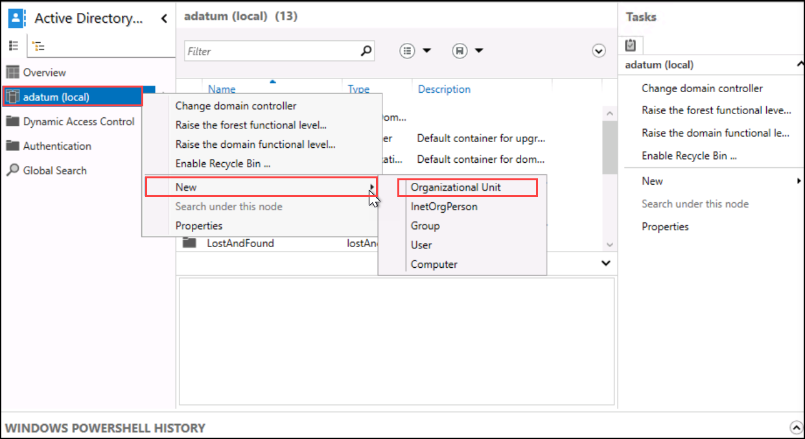
    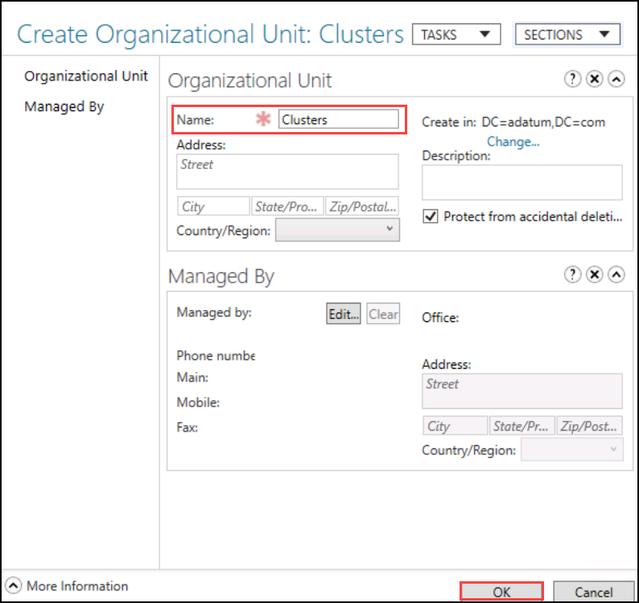

1.  In Active Directory Administrative Center, move the computer accounts of **az12001b-cl-vm0** and **az12001b-cl-vm1** from the **Computers** container to the **Clusters** organizational unit.

1.  Select **adatum(local)** and doubt click on **Computer**
     
  
 1. On computer blade select **az12001b-cl-vm0** and from right side pane click on **Move** and on **Move** select **adatum(local)** and **az12001b-cl-vm0**, click on **OK**.
 
     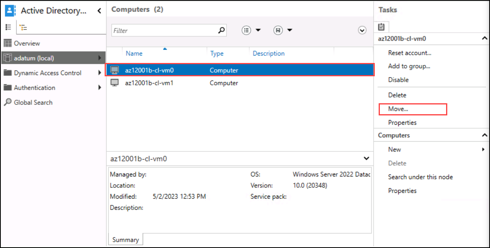
     
     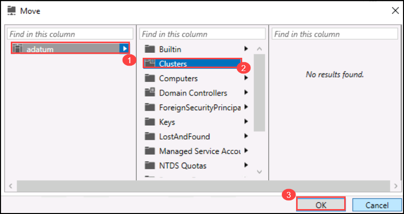
     
 1. Repeat same for **az12001b-cl-vm1**.
     
     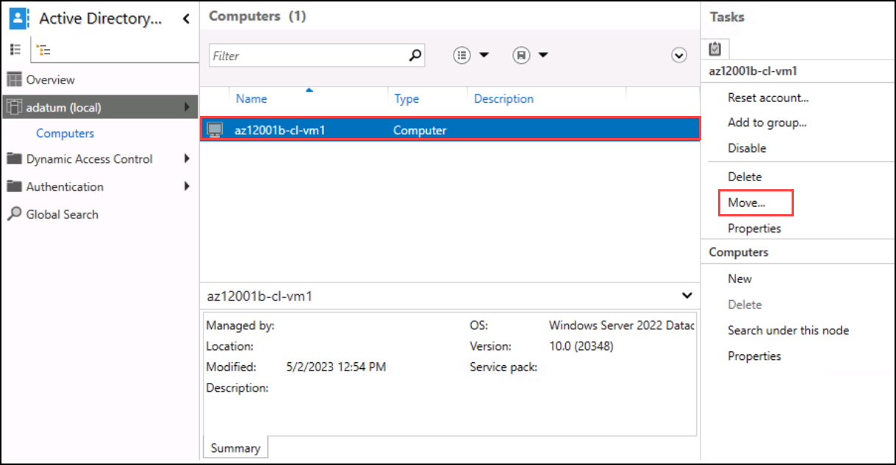
     
     

1.  Within the RDP session to az12001b-cl-vm0, start a Windows PowerShell ISE session and create a new cluster by running the following:

    ```
    $nodes = @('az12001b-cl-vm0','az12001b-cl-vm1')

    New-Cluster -Name az12001b-cl-cl0 -Node $nodes -NoStorage -StaticAddress 10.0.1.6
    ```
    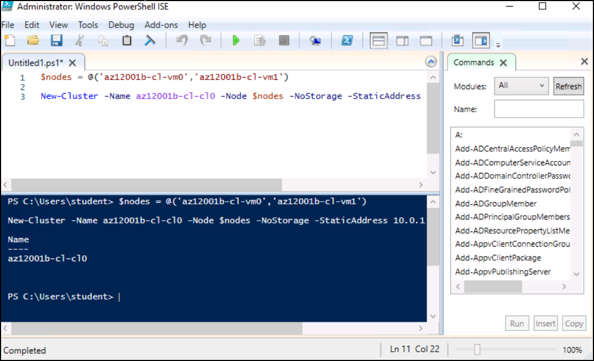

1.  Within the RDP session to az12001b-cl-vm0, switch to the **Active Directory Administrative Center** console.

1.  In Active Directory Administrative Center, navigate to the **Clusters** organizational unit and display its **Properties** window. 

1.  In the **Clusters** organizational unit **Properties** window, navigate to the **Extensions** section, display the **Security** tab. 

1.  On the **Security** tab, click the **Advanced** button to open the **Advanced Security Settings for Clusters** window. 

1.  On the **Permissions** tab of the **Advanced Security Settings for Clusters** window, click **Add**.

1.  In the **Permission Entry for Clusters** window, click **Select Principal**

1.  In the **Select User, Service Account or Group** dialog box, click **Object Types**, enable the checkbox next to the **Computers** entry, and click **OK**. 

1.  Back in the **Select User, Computer, Service Account or Group** dialog box, in the **Enter the object name to select**, type **az12001b-cl-cl0** and click **OK**.

1.  In the **Permission Entry for Clusters** window, ensure that **Allow** appears in the **Type** drop-down list. Next, in the **Applies to** drop-down list, select **This object and all descendant objects**. In the **Permissions** list, select the **Create Computer objects** and **Delete Computer objects** checkboxes, and click **OK** twice.

1.  Within the Windows PowerShell ISE session, install the Az PowerShell module by running the following:

    ```
    Install-PackageProvider -Name NuGet -Force

    Install-Module -Name Az -Force
    ```

1.  Within the Windows PowerShell ISE session, authenticate by using your Azure AD credentials by running the following:

    ```
    Add-AzAccount
    ```

    > **Note**: When prompted, sign in with the work or school or personal Microsoft account with the owner or contributor role to the Azure subscription you are using for this lab.

1.  Within the Windows PowerShell ISE session, set the Cloud Witness quorum of the new cluster by running the following:

    ```
    $resourceGroupName = 'az12001b-cl-RG'

    $cwStorageAccountName = (Get-AzStorageAccount -ResourceGroupName $resourceGroupName)[0].StorageAccountName

    $cwStorageAccountKey = (Get-AzStorageAccountKey -ResourceGroupName $resourceGroupName -Name $cwStorageAccountName).Value[0]

    Set-ClusterQuorum -CloudWitness -AccountName $cwStorageAccountName -AccessKey $cwStorageAccountKey
    ```

1.  To verify the resulting configuration, within the RDP session to az12001b-cl-vm0, from the **Tools** menu in Server Manager, start **Failover Cluster Manager**.

    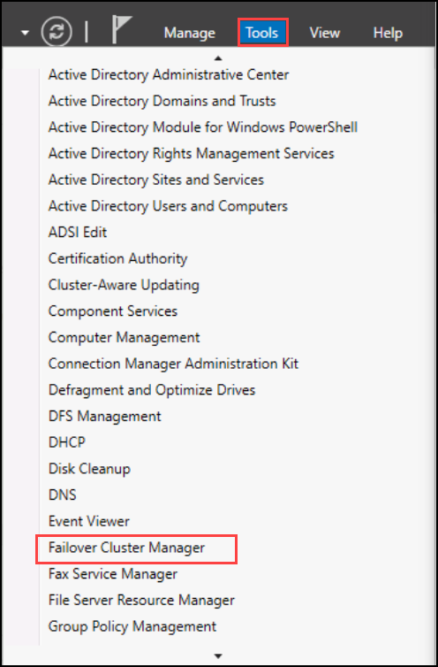

1.  In the **Failover Cluster Manager** console, review the **az12001b-cl-cl0** cluster configuration, including its nodes, as well as is witness and network settings. Notice that the cluster does not have any shared storage.

    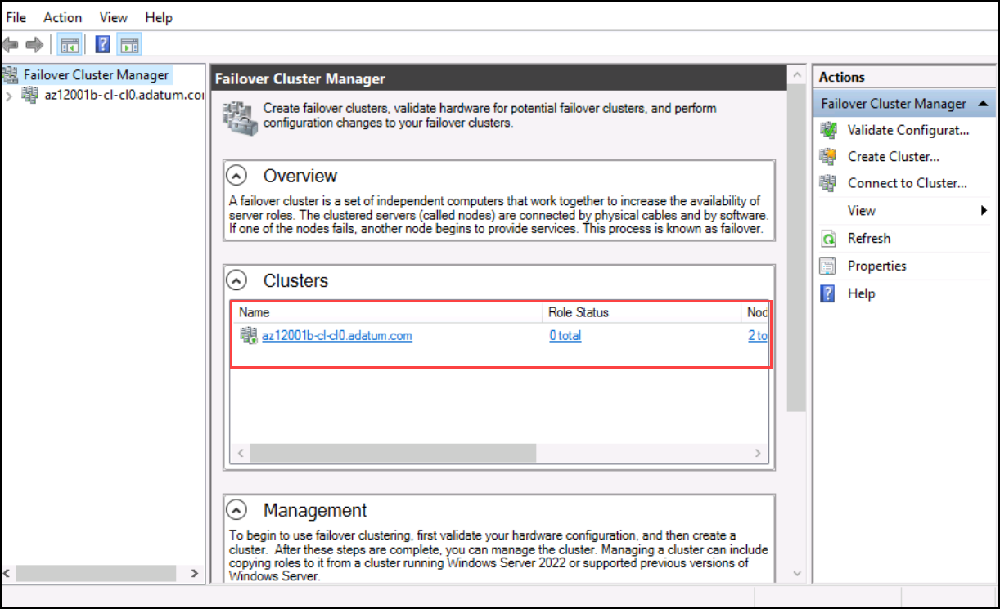

1.  Terminate the RDP session to az12001b-cl-vm0.

> **Result**: After you completed this exercise, you have configured operating system of Azure VMs running Windows Server 2022 to support a highly available SAP NetWeaver installation


## Exercise 3: Provision Azure network resources necessary to support highly available SAP NetWeaver deployments

Duration: 30 minutes

In this exercise, you will implement Azure Load Balancers to accommodate clustered installations of SAP NetWeaver.

### Task 1: Configure Azure VMs to facilitate load balancing setup.

   > **Note**: Since you will be setting up a pair of Azure Load Balancer of the Stardard SKU, you need to first remove the public IP addresses associated with network adapters of two Azure VMs that will be serving as the load-balanced backend pool.

1.  On the lab computer, in the Azure portal, navigate to the blade of the Azure VM **az12001b-cl-vm0**. 

1.  From the **az12001b-cl-vm0** blade, navigate to the blade of the public IP address **az12001b-cl-vm0-ip** associated with its network adapter.

1.  From the **az12001b-cl-vm0-ip** blade, from left pane click on **Networking** first disassociate the public IP address from the network interface and then delete it.

1.  In the Azure portal, navigate to the blade of the Azure VM **az12001b-cl-vm1**. 

1.  From the **az12001b-cl-vm1** blade, navigate to the blade of the public IP address **az12001b-cl-vm1-ip** associated with its network adapter.

1.  From the **az12001b-cl-vm1-ip** blade, first disassociate the public IP address from the network interface and then delete it.

1.  In the Azure portal, navigate to the blade of the **az12001a-vm0** Azure VM.

1.  From the **az12001a-vm0** blade, navigate to its **Networking** blade. 

1.  From the **az12001a-vm0 - Networking** blade, navigate to the network interface of the az12001a-vm0. 

1.  From the blade of the network interface of the az12001a-vm0, navigate to its IP configurations blade and, from there, display its **ipconfig1** blade.

1.  On the **ipconfig1** blade, set the private IP address assignment to **Static** and save the change.

1.  In the Azure portal, navigate to the blade of the **az12001a-vm1** Azure VM.

1.  From the **az12001a-vm1** blade, navigate to its **Networking** blade. 

1.  From the **az12001a-vm1 - Networking** blade, navigate to the network interface of the az12001a-vm1. 

1.  From the blade of the network interface of the az12001a-vm1, navigate to its IP configurations blade and, from there, display its **ipconfig1** blade.

1.  On the **ipconfig1** blade, set the private IP address assignment to **Static** and save the change.

### Task 2: Create and configure Azure Load Balancers handling inbound traffic

1.  In the Azure portal, in the Search resources, services, and docs text box at the top of the Azure portal page, type **Load balancer** then press the Enter key and select **+ Create**.

1.  From the **New** blade, initiate creation of a new Azure Load Balancer with the following settings:

    -   Subscription: *the name of your Azure subscription*

    -   Resource group: *the name of the resource group containing the pair of **Windows Server 2022 Datacenter** Azure VMs you provisioned in the first exercise of this lab*

    -   Name: **az12001b-cl-lb0**

    -   Region: *the same Azure region where you deployed Azure VMs in the first exercise of this lab*

    -   SKU: **Standard**

    -   Type: **Internal**

    -   Frontend IP name: **frontend-ip1**
    
    -   Virtual network: **adVNET**

    -   Subnet: **clSubnet**

    -   IP address assignment: **Static**

    -   IP address: **10.0.1.240**

    -   Availability zone: **Zone-redundant**

1.  Wait until the load balancer is provisioned and then navigate to its blade in the Azure portal.

1.  From the **az12001b-cl-lb0** blade, add a backend pool with the following settings:

    -   Name: **az12001b-cl-lb0-bepool**

    -   Virtual network: **adVNET**

    -   Backend Pool Configuration: **IP address**

    -   IP address: **10.0.1.4** Resource Name **az1201b-cl-vm0**

    -   IP address: **10.0.1.5** Resource Name **az1201b-cl-vm1**
    -   Click on **Save**

1.  From the **az12001b-cl-lb0** blade, add a health probe with the following settings:

    -   Name: **az12001b-cl-lb0-hprobe**

    -   Protocol: **TCP**

    -   Port: **59999**

    -   Interval: **5** *seconds*

    -   Unhealthy threshold: **2** *consecutive failures*

1.  From the **az12001b-cl-lb0** blade, add a network load balancing rule with the following settings:

    -   Name: **az12001b-cl-lb0-lbruletcp1433**

    -   IP version: **IPv4**

    -   Frontend IP address: **10.0.1.240 (LoadBalancerFrontEnd)**

    -   HA Ports: **Disabled**

    -   Protocol: **TCP**

    -   Port: **1433**

    -   Backend port: **1433**

    -   Backend pool: **az12001b-cl-lb0-bepool (2 virtual machines)**

    -   Health probe:**az12001b-cl-lb0-hprobe (TCP:59999)**

    -   Session persistence: **None**

    -   Idle timeout (minutes): **4**

    -   Floating IP (direct server return): **Enabled**

### Task 3: Create and configure Azure Load Balancers handling outbound traffic

1.  From the Azure Portal, start a PowerShell session in Cloud Shell. 

1. In the Cloud Shell pane, run the following command to set the value of the variable `$resourceGroupName` to the name of the resource group containing the pair of **Windows Server 2022 Datacenter** Azure VMs you provisioned in the first exercise of this lab:

    ```
    $resourceGroupName = 'az12001b-cl-RG'
    ```

1.  In the Cloud Shell pane, run the following command to create the public IP address to be used by the second load balancer:

    >**Note**: Replace <Azure_region> with the region where you deployed both the VM's in previous task.

    ```
    $location = '<Azureregion>'

    $pipName = 'az12001b-cl-lb0-pip'

    az network public-ip create --resource-group $resourceGroupName --name $pipName --sku Standard --location $location
    ```

1.  In the Cloud Shell pane, run the following command to create the second load balancer:

    >**Note**: Replace <Azure_region> with the region where you deployed both the VM's in previous task.

    ```
    $location = '<Azureregion>'
    
    $lbName = 'az12001b-cl-lb1'

    $lbFeName = 'az12001b-cl-lb1-fe'

    $lbBePoolName = 'az12001b-cl-lb1-bepool'
   
    $pip = Get-AzPublicIpAddress -ResourceGroupName $resourceGroupName -Name $pipName

    $feIpconfiguration = New-AzLoadBalancerFrontendIpConfig -Name $lbFeName -PublicIpAddress $pip

    $bePoolConfiguration = New-AzLoadBalancerBackendAddressPoolConfig -Name $lbBePoolName

    New-AzLoadBalancer -ResourceGroupName $resourceGroupName -location $location -Name $lbName -Sku Standard -BackendAddressPool $bePoolConfiguration -FrontendIpConfiguration $feIpconfiguration
    ```

1.  Close the Cloud Shell pane.

1.  In the Azure portal, navigate to the blade displaying the properties of the Azure Load Balancer **az12001b-cl-lb1**.

1.  On the **az12001b-cl-lb1** blade, click **Backend pools**.

1.  On the **az12001b-cl-lb1 - Backend pools** blade, click **az12001b-cl-lb1-bepool**.

1.  On the **az12001b-cl-lb1-bepool** blade, specify the following settings and click **Save**:

    -   Virtual network: **adVNET (4 VM)**

    -   VIRTUAL MACHINE: **az12001b-cl-vm0**  IP ADDRESS: **ipconfig1**

    -   VIRTUAL MACHINE: **az12001b-cl-vm1**  IP ADDRESS: **ipconfig1**

1.  On the **az12001b-cl-lb1** blade, click **Health probes**.

1.  From the **az12001b-cl-lb1 - Health probes** blade, add a health probe with the following settings:

    -   Name: **az12001b-cl-lb1-hprobe**

    -   Protocol: **TCP**

    -   Port: **80**

    -   Interval: **5** *seconds*

1.  On the **az12001b-cl-lb1** blade, click **Load balancing rules**.

1.  From the **az12001b-cl-lb1 - Load balancing rules** blade, add a network load balancing rule with the following settings:

    -   Name: **az12001b-cl-lb1-lbharule**

    -   IP version: **IPv4**

    -   Frontend IP address: *accept the default value*

    -   Protocol: **TCP**

    -   Port: **80**

    -   Backend port: **80**

    -   Backend pool: **az12001b-cl-lb1-bepool (2 virtual machines)**

    -   Health probe:**az12001b-cl-lb1-hprobe 
    -   
    -   Protcol: **(TCP:80)**

    -   Session persistence: **None**

    -   Idle timeout (minutes): **4**

    -   TCP reset: Click on **Disabled** 
    
    -   Floating IP (direct server return): **Disabled**

### Task 4: Deploy a jump host

   > **Note**: Since two clustered Azure VMs are no longer directly accessible from Internet, you will deploy an Azure VM running Windows Server 2022 Datacenter that will serve as a jump host. 

1.  From the lab computer, in the Azure portal, navigate to the **Virtual machines** blade, click **+ Create**, and, from the drop-down menu, select **Azure virtual machine**.

1.  From the **Create a virtual machine** blade, initiate provisioning of a **Windows Server 2022 Datacenter: Azure Edition - Gen2** 1.  In the Azure portal, in the Search resources, services, and docs text box at the top of the Azure portal page, type **Storage account** then press the Enter key and select **+ Create**.

    -   Subscription: *the name of your Azure subscription*

    -   Resource group: *the name of the resource group containing the pair of **Windows Server 2022 Datacenter: Azure Edition - Gen2** Azure VMs you provisioned in the first exercise of this lab*

    -   Virtual machine name: **az12001b-vm2**

    -   Region: *the same Azure region where you deployed Azure VMs in the first exercise of this lab*

    -   Availability options: **No infrastructure redundancy required**

    -   Image: **Windows Server 2022 Datacenter: Azure Edition - Gen2**

    -   Size: **Standard DS1 v2*** or similar*

    -   Username: *the same username you specified when deploying the Bicep template in the first exercise of this lab*

    -   Password: *the same password you specified when deploying the Bicep template in the first exercise of this lab*

    -   Public inbound ports: **Allow selected ports**

    -   Select inbound ports: **RDP (3389)**

    -   You already have a Windows license?: **No**


 1. On **Disks** tab of **Create a virtual machine** blade specify the following and select **Next:Networking>**.

      -  OS disk type: **Standard HDD**

 1. On **Networking** tab of **Create a virtual machine** blade specify the following and select **Next:Managemet>**.
      -   Virtual network: **adVNET**
      -   Subnet: *a new subnet named* **bastionSubnet**
      -   Address range: **10.0.255.0/24**

     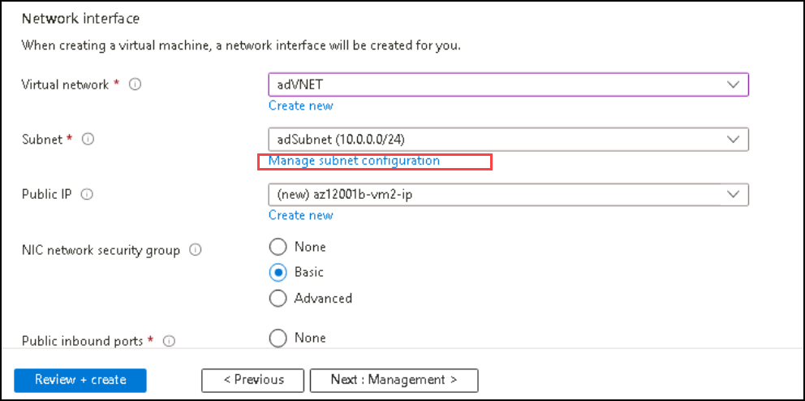
     
        - and click on save

1. Back on **Create a virtual machine** blade specify the following

    -   Subnet: a new subnet named bastionSubnet 

    -   System assigned managed identity: **Off**

    -  Login with AAD credentials (Preview): **Off**

    -   Virtual network: **adVNET**

    -   Subnet: *a new subnet named* **bastionSubnet**

    -   Address range: **10.0.255.0/24**

    -   Public IP address: *a new IP address named* **az12001b-vm2-ip**

    -   NIC network security group: **Basic**

    -   Public inbound ports: **Allow selected ports**

    -   Select inbound ports: **RDP (3389)**

    -   Accelerated networking: **Off**
    
    management
-   System assigned managed identity: **Off**
    -   Place this virtual machine behind an existing load balancing solutions: **No**

   Login with AAD credentials (Preview): **Off**

    -   Enable auto-shutdown: **Off**

    -   Enable backup: **Off**

1. On **Management** tab of **Create a virtual machine** blade specify the following and select **Next:Monitoring>**

    -   OS guest diagnostics: **Off**
    -   Boot diagnostics: **Off**

    -   OS guest diagnostics: **Off**

    -   System assigned managed identity: **Off**

    -   Login with AAD credentials (Preview): **Off**

    -   Enable auto-shutdown: **Off**

    -   Enable backup: **Off**

    -   Extensions: *None*

    -   Tags: *None*

1. Select **Review + Create**

1.  Wait for the provisioning to complete. This should take a few minutes.

1.  Connect to the newly provisioned Azure VM via RDP. 

1.  Within the RDP session to az12001b-vm2, ensure that you can establish RDP session to both az12001b-cl-vm0 and az12001b-cl-vm1 via their private IP addresses (10.0.1.4 and 10.0.1.5, respectively). 

> **Result**: After you completed this exercise, you have provisioned Azure network resources necessary to support highly available SAP NetWeaver deployments

## Exercise 4: Remove lab resources

Duration: 10 minutes

In this exercise, you will remove resources provisioned in this lab.

#### Task 1: Open Cloud Shell

1. At the top of the portal, click the **Cloud Shell** icon to open Cloud Shell pane and choose PowerShell as the shell.

1. In the Cloud Shell pane, run the following command to set the value of the variable `$resourceGroupName` to the name of the resource group containing the pair of **Windows Server 2022 Datacenter** Azure VMs you provisioned in the first exercise of this lab:

    ```
    $resourceGroupNamePrefix = 'az12001b-'
    ```

1. In the Cloud Shell pane, run the following command to list all resource groups you created in this lab:

    ```
    Get-AzResourceGroup | Where-Object {$_.ResourceGroupName -like "$resourceGroupNamePrefix*"} | Select-Object ResourceGroupName
    ```

1. Verify that the output contains only the resource groups you created in this lab. These groups will be deleted in the next task.

#### Task 2: Delete resource groups

1. In the Cloud Shell pane, run the following command to delete the resource groups you created in this lab

    ```
    Get-AzResourceGroup | Where-Object {$_.ResourceGroupName -like "$resourceGroupNamePrefix*"} | Remove-AzResourceGroup -Force  
    ```

1. Close the Cloud Shell pane.

> **Result**: After you completed this exercise, you have removed the resources used in this lab.
